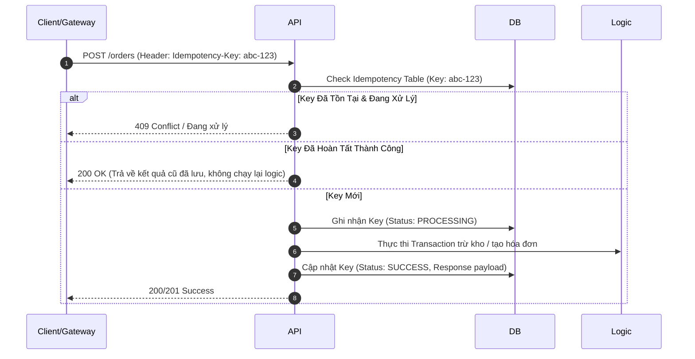

# API Design, Integration Contracts & Webhook Security

Hệ thống bán lẻ đa kênh phụ thuộc sống còn vào các kết nối API: Cổng thanh toán, Webhook ngân hàng, POS client, và Odoo JSON-RPC. Kỹ năng này xác lập tiêu chuẩn thiết kế API bất biến cho Senior Backend & Integration Architect.

---

## 1. Chuẩn Hóa Thiết Kế API & Hợp Đồng Dữ Liệu (Data Contracts)

### Nguyên tắc thiết kế REST / JSON-RPC:
1. **Danh từ số nhiều, phân cấp rõ ràng**:
   - `GET /api/v1/orders` (Danh sách đơn hàng)
   - `POST /api/v1/orders` (Tạo đơn hàng mới)
   - `GET /api/v1/orders/{id}/lines` (Chi tiết dòng sản phẩm của đơn)
2. **HTTP Verbs đúng ngữ nghĩa**:
   - `GET`: Idempotent & Safe (chỉ đọc, không làm thay đổi state).
   - `POST`: Không idempotent (tạo mới tài nguyên).
   - `PUT`: Idempotent (thay thế toàn bộ tài nguyên).
   - `PATCH`: Idempotent (cập nhật từng phần).
   - `DELETE`: Idempotent (xóa tài nguyên).

---

## 2. Phòng Thủ Idempotency (Chống Trùng Lặp Giao Dịch)

Khi mạng lag hoặc người dùng bấm nút 2 lần, hoặc Gateway gửi lại Webhook 5 lần:



---

## 3. Kiến Trúc Bảo Mật Webhook IPN (HMAC Signatures)

1. **Verify chữ ký trước khi đọc dữ liệu**:
   - Mọi Webhook từ VNPay/MoMo phải được tính toán lại Checksum bằng HMAC-SHA512/256 với Secret Key bí mật.
2. **Chống tấn công đo thời gian (Timing-Attack Prevention)**:
   - Tuyệt đối không dùng toán tử `==` để so sánh chuỗi băm chữ ký!
   - Bắt buộc dùng `hmac.compare_digest(hash_a, hash_b)` trong Python hoặc hàm so sánh constant-time để tránh bị hacker phân tích độ trễ mili-giây dò khóa bí mật.
3. **Phản hồi tức thì trong 100ms**:
   - Webhook IPN controller phải trả về `200 OK` (hoặc `{"RspCode": "00"}`) ngay sau khi xác thực chữ ký và lưu message vào hàng đợi.
   - Các tác vụ nặng (gọi Odoo, in hóa đơn VAT, gửi email) phải đẩy sang Background Tasks / Celery, không được block connection của Gateway ngân hàng.

---

## 4. Chuẩn Định Dạng Lỗi RFC 7807 (Problem Details)

Không bao giờ trả về lỗi chung chung `{"error": "Something went wrong"}`. Senior SE dùng chuẩn **RFC 7807**:

```json
{
  "type": "https://api.retail.vn/errors/out-of-stock",
  "title": "Sản phẩm không đủ tồn kho",
  "status": 409,
  "detail": "Biến thể Áo Thun Đen Size L (SKU: APP-TSHIRT-BLK-L) chỉ còn 2 cái khả dụng, yêu cầu 3 cái.",
  "instance": "/orders/checkout",
  "invalid_params": [
    {
      "name": "qty",
      "reason": "Vượt quá tồn kho thực tế đã trừ lượng đệm an toàn (Buffer: 2)"
    }
  ]
}
```

---

## 5. Chiến Lược Retry Với Exponential Backoff & Jitter

Khi gọi API bên thứ ba hoặc gọi RPC vào Odoo bị timeout tạm thời:
- **Công thức tính độ trễ**:
  $$\text{Delay} = \min(\text{MaxDelay}, \text{BaseDelay} \times 2^{\text{attempt}}) + \text{RandomJitter}$$
- Luôn cộng thêm **Jitter (ngẫu nhiên hóa 10-30%)** để tránh hiện tượng hàng nghìn worker cùng thử lại tại cùng một tích tắc (Thundering Herd Problem).
