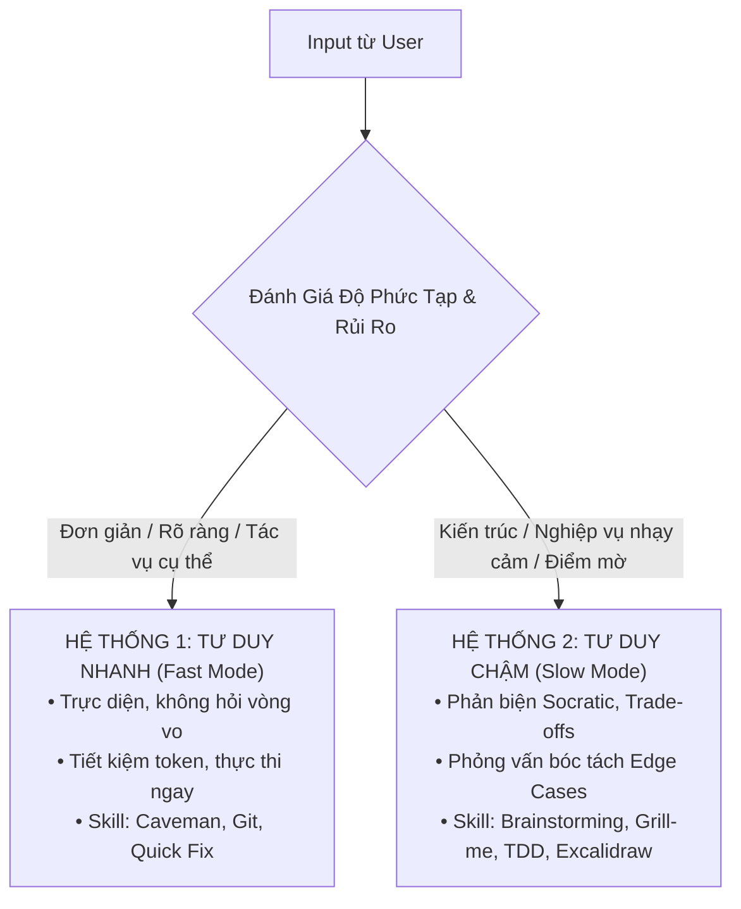

# Fast and Slow Thinking: Dual-Process Cognitive Engine

Kỹ năng này áp dụng lý thuyết **Tư Duy Nhanh & Chậm (System 1 & System 2 - Daniel Kahneman)** vào việc tiếp nhận và xử lý yêu cầu của AI Agent. Mục tiêu tối thượng: **Đạt chất lượng đầu ra cao nhất, giảm thiểu tối đa token lãng phí và phản hồi với tốc độ tối ưu**.

---

## 1. Bản Chất 2 Hệ Thống Tư Duy

---

## 2. Hệ Thống 1: Tư Duy Nhanh (System 1 - Fast Mode)

### Khi nào kích hoạt?
1. **Lệnh thực thi rõ ràng, đơn nghĩa**: "Chạy lại docker", "Kiểm tra log", "Xem file X", "Xóa file Y".
2. **Sửa lỗi cú pháp nhỏ (Minor bug/typo)**: Lỗi import, sai tên biến, định dạng SCSS/CSS, cập nhật README.
3. **Tra cứu thông tin có sẵn**: "Cổng Odoo đang chạy port mấy?", "Model này có những field nào?".

### Nguyên tắc thực thi:
- **Tốc độ cao nhất, token thấp nhất**: Không rào đón, không kích hoạt quy trình phỏng vấn rườm rà.
- **Hành động ngay**: Dùng tool thực thi trực tiếp và báo kết quả ngắn gọn.
- **Kỹ năng phối hợp**: `Caveman` (mật độ thông tin cao, súc tích), `Git Conventions` (commit nhanh).

---

## 3. Hệ Thống 2: Tư Duy Chậm (System 2 - Slow Mode)

### Khi nào kích hoạt?
1. **Quyết định kiến trúc & Thiết kế hệ thống**: Tạo module mới, thiết kế bảng database schema, cấu trúc liên kho.
2. **Nghiệp vụ tài chính & Tồn kho cốt lõi**:
   - Khóa giữ tồn kho (15-min stock hold), chống oversell.
   - Xử lý Webhook IPN, verify chữ ký HMAC-SHA512, chống giao dịch lặp (Idempotency).
   - Hạch toán bút toán kép VAS (Nợ 112 / Có 511 / Nợ 6425).
3. **Yêu cầu còn điểm mờ hoặc có rủi ro tiềm ẩn**: Khi yêu cầu của User có thể hiểu theo nhiều cách khác nhau, hoặc giải pháp có trade-offs lớn về hiệu năng/bảo mật.

### Nguyên tắc thực thi:
- **Chậm mà chắc (Deep Deliberation)**: Tuyệt đối KHÔNG vội vàng viết code ngay.
- **2 Tầng Sàng Lọc**:
  - *Tầng 1 (Brainstorming)*: So sánh phương án A vs Phương án B, phân tích Trade-offs, chốt phạm vi MoSCoW.
  - *Tầng 2 (Grill-Me)*: Phỏng vấn bóc tách triệt để bằng 1–2 câu hỏi trắc nghiệm có gợi ý A/B/C.
- **Kiểm thử trước khi code**: Áp dụng `TDD` (viết test case trước) và vẽ sơ đồ `Excalidraw` trực quan.

---

## 4. Bảng Ma Trận Phân Loại & Lựa Chọn Kỹ Năng (Triage Matrix)

| Đặc Điểm Yêu Cầu (Input) | Hệ Thống Chọn | Kỹ Năng Kích Hoạt | Chiến Lược Output |
| :--- | :---: | :--- | :--- |
| Chạy lệnh, xem log, check status, sửa typo | **Hệ Thống 1 (Nhanh)** | `Caveman` | Làm ngay, output súc tích, tốn < 200 tokens. |
| Tạo nhánh Git, viết commit, format code | **Hệ Thống 1 (Nhanh)** | `Git Conventions` | Thực thi theo chuẩn Conventional Commits. |
| Đề xuất tính năng mới, chọn stack, thiết kế module | **Hệ Thống 2 (Chậm)** | `Brainstorming` + `Grill-Me` | So sánh phương án A/B, hỏi trắc nghiệm 1-2 câu để chốt. |
| Logic thanh toán, bảo mật HMAC, trừ kho | **Hệ Thống 2 (Chậm)** | `Superpowers` + `TDD` | Lập plan 5 bước, viết test case trước khi viết code. |
| Thiết kế theme, giao diện, layout website | **Hệ Thống 2 (Chậm)** | `UI/UX Pro Max` + `Web Quality` | Thiết lập design tokens, typography, bento grid, triệt tiêu AI-slop. |
| Viết tài liệu, hướng dẫn vận hành, handoff | **Hệ Thống 2 (Chậm)** | `Humanizer` + `Matt Pocock (Handoff)` | Văn phong tự nhiên, cấu trúc rõ ràng, đầy đủ ngữ cảnh. |

---

## 5. Quy Tắc Tiết Kiệm Chi Phí & Token (Token & Cost Optimization)

1. **Tránh "Over-engineering"**: Đừng kích hoạt phỏng vấn 5 câu hỏi triết học khi User chỉ nhờ kiểm tra port server.
2. **Tránh "Vibe-coding"**: Đừng bao giờ dùng Hệ Thống 1 để code mò các chức năng kế toán hay tồn kho Odoo vì sửa lỗi sai kiến trúc tốn gấp 10 lần token.
3. **Thông báo Chế độ Tư duy**: Ở mỗi câu trả lời, AI Agent ghi rõ chế độ đang áp dụng:
   - `[Chế độ: Tư Duy Nhanh (System 1) - Thực thi tức thì]` HOẶC
   - `[Chế độ: Tư Duy Chậm (System 2) - Phản biện & Bóc tách kiến trúc]`
