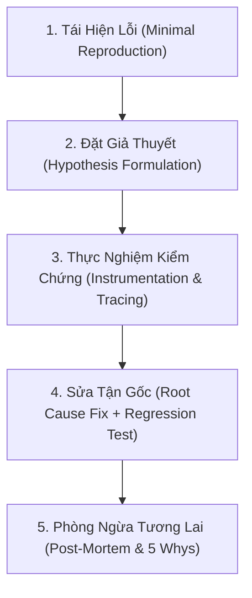

# Systematic Debugging & Root Cause Analysis (RCA)

Senior Software Engineers do not guess, tweak random lines of code, or "vibe-debug". They treat software failures as scientific anomalies requiring empirical proof, controlled experiments, and structural prevention.

---

## 1. Chu Trình 5 Bước Debugging Khoa Học (Scientific Debugging Cycle)

---

## 2. Bước 1: Tái Hiện Lỗi Độc Lập (Minimal Reproducible Example)

- **Quy tắc vàng**: *"Nếu bạn không thể tái hiện được lỗi bằng 1 test case hoặc 1 script độc lập, bạn chưa thực sự hiểu lỗi đó."*
- **Hành động bắt buộc**:
  1. Thu thập Input chính xác gây lỗi (payload, params, database state, user session).
  2. Cô lập môi trường: Tạo 1 unit test hoặc 1 integration test chạy độc lập (trong Odoo hoặc pytest) để test này **CHẮC CHẮN FAIL (Red)**.
  3. Loại bỏ mọi yếu tố nhiễu bên ngoài (cắt tỉa payload đến khi chỉ còn dữ liệu tối thiểu gây lỗi).

---

## 3. Bước 2 & 3: Đặt Giả Thuyết & Thực Nghiệm (Hypothesis-Driven Debugging)

- **Không đoán mò**: Đưa ra tối thiểu 2 giả thuyết có thể kiểm chứng được:
  - *Giả thuyết A*: Do race condition khi 2 tiến trình cùng đọc `quant.quantity` trước khi lock.
  - *Giả thuyết B*: Do timezone lệch giữa server UTC và client GMT+7 khi tính toán thời gian hết hạn (15 phút).
- **Kỹ thuật cô lập (Binary Search & Instrumentation)**:
  - Sử dụng logging có cấu trúc (`_logger.info("CHECKPOINT: state=%s, qty=%s", state, qty)`).
  - Sử dụng `git bisect` để tìm chính xác commit đầu tiên sinh ra lỗi trong lịch sử mã nguồn.
  - Kiểm tra transaction isolation level và database locks (`pg_locks`, `SELECT FOR UPDATE`).

---

## 4. Bước 4: Sửa Tận Gốc (Fix Root Cause, Not Symptoms)

| Triệu Chứng (Chữa Cháy / Junior) | Nguyên Nhân Gốc (Root Cause / Senior) |
| :--- | :--- |
| Bọc `try ... except Exception: pass` để app không crash | Sửa logic validation dữ liệu đầu vào hoặc handle typed exception cụ thể. |
| Thêm `sleep(2)` để đợi dữ liệu đồng bộ | Dùng database lock, event queue, hoặc callback để đồng bộ có điều kiện. |
| Xóa cache thủ công khi số liệu lệch | Fix logic invalidation cache hoặc tính toán lại trường compute bằng `depends`. |
| Thêm `if obj is None: return` rải rác | Thiết lập ràng buộc `required=True` ở cấp database schema hoặc model constraints. |

---

## 5. Bước 5: Kỹ Thuật "5 Whys" & Báo Cáo Sự Cố (Post-Mortem)

Khi giải quyết xong một lỗi nghiêm trọng, áp dụng kỹ thuật **5 Whys**:
1. *Tại sao đơn hàng bị oversell?* → Vì 2 khách cùng thanh toán 1 sản phẩm cuối cùng.
2. *Tại sao 2 khách cùng thanh toán được?* → Vì hệ thống chỉ trừ kho sau khi nhận webhook IPN từ cổng thanh toán.
3. *Tại sao không trừ kho trước?* → Vì sợ khách không thanh toán sẽ làm mất hàng bán.
4. *Tại sao không có cơ chế giữ tạm thời?* → Vì chưa thiết kế tính năng khóa giữ tồn kho (15-Minute Reservation).
5. *Tại sao chưa thiết kế?* → **Root Cause**: Chưa có quy chuẩn kiến trúc cho luồng bán hàng đa kênh liên thông cổng thanh toán.

**Hành động phòng ngừa vĩnh viễn**:
- Viết regression test tự động trong CI/CD.
- Thêm alert cảnh báo khi tỷ lệ rollback giao dịch tăng đột biến.
- Cập nhật tài liệu kỹ thuật [HANDOFF.md](file:///d:/Joyce/My%20documents/Pjs/Pjs%20src/new%20pj/HANDOFF.md).
