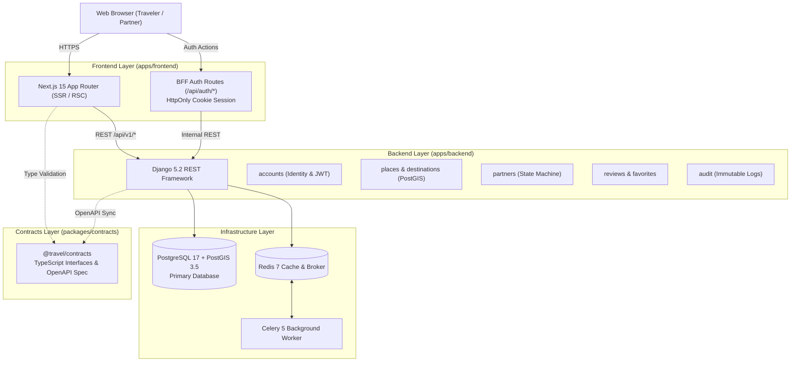

<div align="center">

# Wanderlust Vietnam

### Travel Discovery, Partner Onboarding & Content Platform

*A production-ready polyglot monorepo featuring a Next.js 15 customer web application, Django 5.2 REST Framework modular monolith, PostGIS geospatial engine, and shared TypeScript data contracts.*

---

[](https://github.com/STAR-Trevaling/Website-Traveling/actions)
[](https://nextjs.org/)
[](https://react.dev/)
[](https://www.typescriptlang.org/)
[](https://www.djangoproject.com/)
[](https://www.postgresql.org/)
[](https://postgis.net/)
[](https://redis.io/)
[](LICENSE)

<br/>

[Overview](#overview) • [Architecture](#architecture) • [Repository Layout](#repository-layout) • [Quickstart](#quickstart) • [Local Development](#local-development) • [API Reference](#api-reference) • [Verification](#verification)

</div>

---

## Overview

Wanderlust Vietnam is a modern, full-stack travel discovery and partner operations platform. The system is designed around domain-driven design principles, strict transaction boundaries, and end-to-end type safety across the polyglot stack.

### Engineering Highlights

- **PostGIS Geospatial Discovery**: High-performance spatial indexing (`GIST`) and radius queries (`ST_DWithin`) powering nearby place exploration across Vietnam's travel destinations.
- **Next.js 15 & React 19 Frontend**: Server-Side Rendering (SSR) and React Server Components (RSC) backed by a Backend-for-Frontend (BFF) layer that enforces `HttpOnly` cookie-based authentication, preventing token exposure to client-side scripts.
- **Decoupled Modular Monolith**: 8 isolated Django applications (`accounts`, `destinations`, `places`, `partners`, `content`, `reviews`, `audit`, `core`) with encapsulated services and explicit transactional boundaries.
- **B2B Partner State Machine**: Finite-state machine managing partner applications (`submitted` -> `under_review` -> `approved`/`rejected`) with row-level locking (`select_for_update`) and immutable audit trails.
- **Shared Data Contracts (`@travel/contracts`)**: Pure TypeScript definitions and OpenAPI 3.1 specifications synchronizing API schemas across frontend and backend without runtime coupling.
- **Security & Quality Automation**: Comprehensive CI pipeline with PostGIS 17 service containers, Bandit SAST security scans, TruffleHog secret detection, CodeQL semantic analysis, and full test suites.

---

## Architecture



---

## Repository Layout

```text
travel-platform-mvp-complete/
├── apps/
│   ├── backend/                  # Django 5.2 REST Framework modular monolith
│   │   ├── accounts/             # Identity, roles, JWT authentication
│   │   ├── audit/                # Immutable privileged event logs
│   │   ├── config/               # Settings, ASGI/WSGI, Celery, URLs
│   │   ├── content/              # Editorial travel stories & articles
│   │   ├── core/                 # Seed commands, base pagination, exceptions
│   │   ├── destinations/         # Destination entities & metadata
│   │   ├── partners/             # Partner application state machine & services
│   │   ├── places/               # Places, categories & PostGIS geospatial search
│   │   ├── reviews/              # User reviews & saved favorites
│   │   ├── tests/                # Pytest unit & integration test suites
│   │   ├── Dockerfile            # Production Python container
│   │   ├── manage.py
│   │   └── requirements.txt      # Python dependencies
│   │
│   └── frontend/                 # Next.js 15 customer web application
│       ├── public/               # Static assets & photography
│       ├── src/
│       │   ├── app/              # App Router pages & BFF handlers
│       │   ├── components/       # Radix UI primitives, layout & feature components
│       │   └── lib/              # Client API, auth utils & contracts bridge
│       ├── Dockerfile            # Production Next.js container
│       ├── eslint.config.mjs     # ESLint 9 configuration
│       ├── package.json          # Node dependencies
│       └── tsconfig.json         # Path aliases (@/* and @travel/contracts)
│
├── packages/
│   └── contracts/                # [@travel/contracts] Shared API contracts
│       ├── src/index.ts          # Pure TypeScript interfaces & payloads
│       ├── package.json
│       └── tsconfig.json
│
├── docs/                         # Technical documentation & reference archive
│   ├── design-reference/         # High-resolution UI mockups & reference notes
│   ├── implementation-plan.md
│   └── validation-report.md
│
├── context/                      # Canonical AI architecture & workflow contracts (AGENTS.md)
├── scripts/                      # Static sanity (AST check) & context validation scripts
├── .agents/                      # Engineering skill registry
├── docker-compose.yml            # Multi-container orchestration (PostGIS, Redis, API, Web)
├── Makefile                      # Standard developer workflows
└── .github/workflows/            # GitHub Actions CI & CodeQL security pipelines
```

---

## Quickstart

Get the full platform running locally via Docker Compose in under three minutes:

```bash
# 1. Clone repository and initialize environment variables
git clone https://github.com/STAR-Trevaling/Website-Traveling.git
cd Website-Traveling
cp .env.example .env

# 2. Spin up PostGIS and Redis services
docker compose up --build -d db redis

# 3. Apply database migrations and seed demo data
docker compose run --rm backend python manage.py migrate
docker compose run --rm backend python manage.py seed_demo

# 4. Start backend API, Celery worker, and Next.js frontend
docker compose up --build -d backend worker frontend
```

### Service Map & Credentials

| Service | Endpoint | Description | Default Credentials |
|---|---|---|---|
| **Customer Web** | `http://localhost:3000` | Next.js 15 customer portal | Public |
| **REST API** | `http://localhost:8000/api/v1/` | Django REST Framework root | Public / Bearer JWT |
| **OpenAPI Docs** | `http://localhost:8000/api/v1/docs/` | Interactive Swagger UI | Public |
| **Django Admin** | `http://localhost:8000/admin/` | Platform administration portal | `admin_demo` / `AdminDemo123!` |

*Demo traveler account: `traveler_demo` / `TravelerDemo123!`*

---

## Local Development

You can run frontend and backend independently on your host machine:

### 1. Frontend (`apps/frontend`)

```bash
cd apps/frontend
cp .env.example .env.local
npm install
npm run dev
```

### 2. Backend (`apps/backend`)

*Prerequisites: Local PostgreSQL with PostGIS extension and Redis.*

```bash
cd apps/backend
python -m venv .venv

# Activate virtual environment
# POSIX (Linux/macOS):
source .venv/bin/activate
# Windows PowerShell:
.venv\Scripts\Activate.ps1

pip install -r requirements.txt
python manage.py migrate
python manage.py runserver 8000
```

---

## API Reference

All REST endpoints are versioned under `/api/v1/`:

| Context | Method | Endpoint | Description | Auth Required |
|---|---|---|---|---|
| **Identity** | `POST` | `/api/v1/auth/register/` | Register new customer account | Public |
| **Identity** | `POST` | `/api/v1/auth/token/` | Obtain JWT access and refresh tokens | Public |
| **Identity** | `POST` | `/api/v1/auth/token/refresh/` | Refresh expired access token | Public |
| **Identity** | `GET` | `/api/v1/auth/me/` | Current user profile and role | Bearer JWT |
| **Destinations** | `GET` | `/api/v1/destinations/` | List and search destinations | Public |
| **Places** | `GET` | `/api/v1/places/` | Filter places by destination and category | Public |
| **Places** | `GET` | `/api/v1/places/nearby/` | Spatial discovery (`?lat=&lng=&radius_km=`) | Public |
| **Stories** | `GET` | `/api/v1/articles/` | Editorial travel articles | Public |
| **Reviews** | `GET` | `/api/v1/reviews/` | List reviews for places | Public |
| **Reviews** | `POST` | `/api/v1/reviews/` | Create review (1 per place per user) | Bearer JWT |
| **Favorites** | `GET` | `/api/v1/favorites/` | List traveler bookmarked places | Bearer JWT |
| **Favorites** | `POST` | `/api/v1/favorites/` | Bookmark or save place | Bearer JWT |
| **Partners** | `POST` | `/api/v1/partner-applications/` | Submit B2B partnership application | Bearer JWT |
| **Partners** | `POST` | `/api/v1/partner-applications/{id}/approve/` | Admin: atomic approval & org provision | Staff |
| **Partners** | `POST` | `/api/v1/partner-applications/{id}/reject/` | Admin: reject application | Staff |
| **Schema** | `GET` | `/api/v1/schema/` | OpenAPI 3.1 JSON/YAML schema | Public |
| **Docs** | `GET` | `/api/v1/docs/` | Interactive Swagger documentation | Public |

---

## Verification

The repository enforces strict code quality and security standards in CI:

```bash
# Monorepo static AST validation and context integrity
python scripts/validate_context.py
python scripts/static_sanity.py

# Frontend quality checks
npm --prefix apps/frontend run typecheck   # 0 TypeScript diagnostics
npm --prefix apps/frontend run lint        # ESLint 9 clean
npm --prefix apps/frontend run build       # Next.js production build

# Backend quality checks
ruff check apps/backend                    # Lint check
ruff format --check apps/backend           # Style check
mypy apps/backend                          # Static typing
bandit -r apps/backend -ll                 # Security SAST
pytest apps/backend                        # Integration tests
```

---

## License

This project is open-source software licensed under the [MIT License](LICENSE).
