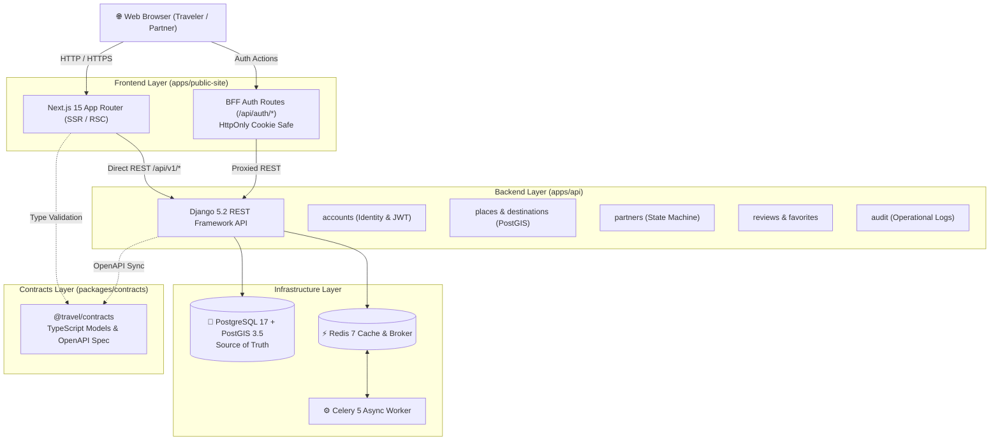

<div align="center">

# 🌍 Wanderlust Vietnam

### Travel Discovery, Partner Onboarding & Content Platform

*A production-grade polyglot monorepo featuring a Next.js 15 customer web application, a Django 5.2 REST Framework modular monolith, PostGIS geospatial engine, and shared TypeScript data contracts.*

---

[](https://nextjs.org/)
[](https://react.dev/)
[](https://www.typescriptlang.org/)
[](https://www.djangoproject.com/)
[](https://www.postgresql.org/)
[](https://postgis.net/)
[](https://redis.io/)
[](https://tailwindcss.com/)
[](https://www.docker.com/)

<br/>

[Key Highlights](#-key-engineering-highlights) • [Architecture](#-system-architecture) • [Repository Layout](#-repository-layout) • [Quickstart](#-quickstart-with-docker) • [Local Development](#-local-development) • [API Reference](#-rest-api-reference) • [Quality & CI](#-quality-assurance--testing)

</div>

---

## 🚀 Key Engineering Highlights

- 📍 **PostGIS Geospatial Discovery**: High-performance radius queries (`ST_DWithin`) with spatial indexing for places, experiences, and attractions near travelers.
- ⚡ **Next.js 15 & React 19 Frontend**: Server-Side Rendering (SSR), React Server Components (RSC), and Backend-for-Frontend (BFF) route handlers managing secure `HttpOnly` cookie authentication (no tokens in `localStorage`).
- 🏛️ **Django Modular Monolith**: 8 decoupled bounded contexts (`accounts`, `destinations`, `places`, `partners`, `content`, `reviews`, `audit`, `core`) with strict transaction boundaries.
- 🤝 **B2B Partner State Machine**: Atomic application transitions (`submitted -> under_review -> approved/rejected`) with row-level database locking and audit event logging.
- 📦 **Shared Data Contracts (`@travel/contracts`)**: Pure TypeScript definitions and OpenAPI 3.1 specifications eliminating API drift between frontend and backend without leaking source code.
- 🎨 **Responsive Template Reconstruction**: Re-engineered from the Anima Star Travels reference into clean CSS Grid/Flexbox layouts with Radix UI primitives and full SEO metadata.

---

## 📐 System Architecture



---

## 🗂️ Repository Layout

```text
travel-platform-mvp-complete/
├── apps/
│   ├── api/                      # Django 5.2 REST Framework modular monolith
│   │   ├── accounts/             # Identity, roles, JWT authentication
│   │   ├── audit/                # Immutable privileged event logs
│   │   ├── config/               # Settings, ASGI/WSGI, Celery, root URLs
│   │   ├── content/              # Editorial travel stories & articles
│   │   ├── core/                 # Seed commands, base pagination, exceptions
│   │   ├── destinations/         # Destination entities & metadata
│   │   ├── partners/             # Partner application state machine & services
│   │   ├── places/               # Places, categories & PostGIS geospatial search
│   │   ├── reviews/              # User reviews & saved favorites
│   │   ├── tests/                # Pytest unit & integration test suites
│   │   ├── Dockerfile            # Production Python container
│   │   ├── manage.py
│   │   └── requirements.txt      # Python dependencies
│   │
│   └── public-site/              # Next.js 15 customer web application
│       ├── public/               # Static assets, hero images, adventure graphics
│       ├── src/
│       │   ├── app/              # 19 static & dynamic App Router pages
│       │   ├── components/       # Radix UI primitives, layout & feature components
│       │   └── lib/              # Client API, auth utils & contracts bridge
│       ├── Dockerfile            # Production Next.js container
│       ├── eslint.config.mjs     # ESLint 9 flat configuration
│       ├── package.json          # Node/TypeScript dependencies
│       └── tsconfig.json         # Path aliases (@/* and @travel/contracts)
│
├── packages/
│   └── contracts/                # [@travel/contracts] Shared API contracts & data models
│       ├── src/index.ts          # Pure TypeScript interfaces & payloads
│       ├── package.json
│       └── tsconfig.json
│
├── docs/                         # Technical documentation & reference archive
│   ├── design-reference/         # High-resolution UI mockups & parity notes
│   ├── reference/anima-original/ # Reconstructed Anima/Vite design reference
│   ├── implementation-plan.md
│   └── validation-report.md
│
├── context/                      # Canonical AI architecture & workflow rules (AGENTS.md)
├── scripts/                      # Static sanity (AST check) & context validation scripts
├── .agents/                      # Complete suite of 20 agent skills
├── docker-compose.yml            # Multi-container orchestration (PostGIS, Redis, API, Web)
├── Makefile                      # Standard developer workflows
└── .github/workflows/ci.yml      # GitHub Actions CI/CD pipelines
```

---

## ⚡ Quickstart with Docker

Get the full platform running locally in under 3 minutes:

```bash
# 1. Clone repository and initialize environment variables
git clone https://github.com/huynguyen2k5/Website-Traveling.git
cd Website-Traveling
cp .env.example .env

# 2. Spin up PostGIS and Redis
docker compose up --build -d db redis

# 3. Run database migrations & seed demo dataset
docker compose run --rm backend python manage.py migrate
docker compose run --rm backend python manage.py seed_demo

# 4. Launch Django backend, Celery worker, and Next.js frontend
docker compose up --build -d backend worker frontend
```

### Active Services & Ports

| Service | URL | Description | Default Credentials |
|---|---|---|---|
| **Customer Web** | [http://localhost:3000](http://localhost:3000) | Next.js 15 customer portal | Public |
| **REST API** | [http://localhost:8000/api/v1/](http://localhost:8000/api/v1/) | Django REST Framework API root | Public / Bearer JWT |
| **OpenAPI Docs** | [http://localhost:8000/api/v1/docs/](http://localhost:8000/api/v1/docs/) | Interactive Swagger UI | Public |
| **Django Admin** | [http://localhost:8000/admin/](http://localhost:8000/admin/) | Platform administration dashboard | `admin_demo` / `AdminDemo123!` |

*Traveler demo account: `traveler_demo` / `TravelerDemo123!`*

---

## 💻 Local Development

Run frontend and backend independently on your host machine:

### 1. Frontend (`apps/public-site`)
```bash
cd apps/public-site
cp .env.example .env.local
npm install
npm run dev
```

### 2. Backend (`apps/api`)
*Requires local PostgreSQL 17 with PostGIS extension and Redis.*
```bash
cd apps/api
python -m venv .venv

# Activate virtual environment
# On Linux/macOS:
source .venv/bin/activate
# On Windows PowerShell:
.venv\Scripts\Activate.ps1

pip install -r requirements.txt
python manage.py migrate
python manage.py runserver 8000
```

---

## 📡 REST API Reference

All endpoints are versioned under `/api/v1/`:

| Context | Method | Endpoint | Description | Auth Required |
|---|---|---|---|---|
| **Identity** | `POST` | `/api/v1/auth/register/` | Register new customer account | Public |
| **Identity** | `POST` | `/api/v1/auth/token/` | Obtain JWT access + refresh tokens | Public |
| **Identity** | `POST` | `/api/v1/auth/token/refresh/` | Refresh expired access token | Public |
| **Identity** | `GET` | `/api/v1/auth/me/` | Current user profile & platform role | Bearer JWT |
| **Destinations** | `GET` | `/api/v1/destinations/` | List and search destinations | Public |
| **Places** | `GET` | `/api/v1/places/` | Filter places by destination/category | Public |
| **Places** | `GET` | `/api/v1/places/nearby/` | PostGIS spatial discovery (`?lat=&lng=&radius_km=`) | Public |
| **Stories** | `GET` | `/api/v1/articles/` | Editorial articles and travel stories | Public |
| **Reviews** | `GET` | `/api/v1/reviews/` | List place reviews | Public |
| **Reviews** | `POST` | `/api/v1/reviews/` | Create review (1 per place per user) | Bearer JWT |
| **Favorites** | `GET` | `/api/v1/favorites/` | List traveler saved favorites | Bearer JWT |
| **Favorites** | `POST` | `/api/v1/favorites/` | Save / bookmark place | Bearer JWT |
| **Partners** | `POST` | `/api/v1/partner-applications/` | Submit B2B partnership application | Bearer JWT |
| **Partners** | `POST` | `/api/v1/partner-applications/{id}/approve/` | Admin: atomic approval & org provision | Staff |
| **Partners** | `POST` | `/api/v1/partner-applications/{id}/reject/` | Admin: reject application | Staff |
| **Schema** | `GET` | `/api/v1/schema/` | OpenAPI 3.1 JSON/YAML schema | Public |
| **Docs** | `GET` | `/api/v1/docs/` | Interactive Swagger UI | Public |

---

## 🛠️ Quality Assurance & Testing

```bash
# Monorepo static AST validation & context integrity
python scripts/validate_context.py
python scripts/static_sanity.py

# Frontend quality suite
npm --prefix apps/public-site run typecheck   # 0 TypeScript errors
npm --prefix apps/public-site run lint        # ESLint 9 (0 errors, 0 warnings)
npm --prefix apps/public-site run build       # Next.js 15 production build

# Backend quality suite (via Docker)
make backend-check
```

---

## 📄 License & Attribution

Designed and engineered with passion for Vietnam travel. Built with Next.js 15, Django 5.2, and PostGIS.
Licensed under the [MIT License](LICENSE).
