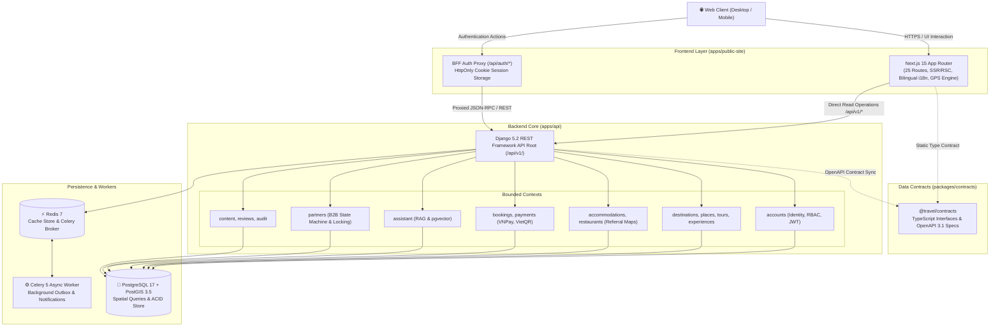

<div align="center">


# STAR Travels

### Enterprise Travel Discovery, Partner Onboarding & Geospatial Intelligence Platform

*A production-ready polyglot monorepo engineered with Next.js 15.5 App Router, React 19, Django 5.2 LTS modular monolith, PostGIS 3.5 spatial engine, and shared TypeScript data contracts.*

<br/>

[](https://nextjs.org/)
[](https://react.dev/)
[](https://www.typescriptlang.org/)
[](https://www.djangoproject.com/)
[](https://www.postgresql.org/)
[](https://postgis.net/)
[](https://redis.io/)
[](https://tailwindcss.com/)
[](https://www.docker.com/)
[](#-quality-assurance--testing)
[](LICENSE)

<br/>

[Overview](#-overview) • [Key Highlights](#-key-engineering-highlights) • [System Architecture](#-system-architecture) • [Repository Layout](#-repository-layout) • [Quickstart (Docker)](#-quickstart-with-docker) • [Local Development](#-local-development) • [REST API Reference](#-rest-api-reference) • [Configuration](#-environment-configuration) • [Quality & Testing](#-quality-assurance--testing)

</div>

---

## 📖 Overview

**STAR Travels** (`STAR`) is an enterprise-grade travel discovery and merchant onboarding platform tailored for exploring destinations, cultural experiences, curated tours, and verified hospitality across Vietnam.

Built upon strict **Clean/Hexagonal Architecture** and pragmatic **DDD-lite** boundaries, the platform decouples a modern Next.js 15 customer web application from a resilient Django 5.2 REST Framework backend. It eliminates schema drift through a standalone shared TypeScript contract layer (`@travel/contracts`) and guarantees data integrity via row-locked partner workflows and PostGIS spatial indexing.

---

## 🚀 Key Engineering Highlights

| Capability | Technical Implementation | Value Delivered |
|---|---|---|
| 🧭 **GPS & Geolocation** | Client-side Web Geolocation API & Haversine distance algorithm (`lib/geo-utils.ts`). | Live distance calculation (`~850 m`, `~1.2 km`), nearest-venue sorting, and smart badges on stays & dining. |
| 🏨 **Affiliate Referrals** | Non-blocking beacon tracking (`POST /api/v1/referrals/track/`) mapping bookings to partners. | Tracking referral conversions for Booking.com, Agoda, TableCheck with zero payment friction. |
| 💳 **Tour Bookings & Pay** | Server-side price recalculation, VNPay Sandbox, and VietQR (NAPAS 247) integration. | Bulletproof checkout with zero client price tampering and automatic transaction ledger updates. |
| 🤖 **AI Concierge & RAG** | Dual-tier RAG engine (Django pgvector semantic search + client-side deterministic fallback). | Prompt-injection-safe itinerary recommendations, regional discovery, and CRM lead capture. |
| ⚖️ **Legal Compliance** | Decrees 13/2023/NĐ-CP (PDPD) and 52/2013/NĐ-CP (E-Commerce) integration (`/privacy`, `/terms`). | Explicit consent checkboxes, privacy protection, and full MOIT corporate disclosures. |
| 📍 **Geospatial Discovery** | PostGIS 3.5 spatial indexing with `ST_DWithin` radius queries (`?lat=&lng=&radius_km=`). | Real-time discovery of nearby attractions, heritage sites, and experiences. |
| ⚡ **Next.js 15 & React 19** | App Router, Server-Side Rendering (SSR), React Server Components (RSC), and Edge middleware. | Sub-second page loads, optimal Core Web Vitals, and indexable SEO metadata. |
| 🛡️ **BFF Cookie Security** | Next.js Backend-for-Frontend routes (`/api/auth/*`) issuing secure `HttpOnly` session cookies. | Eliminates token storage in `localStorage` to defend against Cross-Site Scripting (XSS). |
| 🌐 **100% Bilingual System** | Pure Vietnamese (`vi`) and English (`en`) dictionary toggle with zero mixed-language UI bleeding. | First-class UX for domestic travelers and international explorers alike. |
| 🏛️ **Modular Monolith** | 13 decoupled bounded contexts in Django (`accounts`, `destinations`, `places`, `tours`, `experiences`, `bookings`, `payments`, `assistant`, `accommodations`, `restaurants`, `partners`, `content`, `reviews`). | Clean separation of concerns with atomic transactional boundaries. |
| 🤝 **Partner State Machine** | Strict state transitions (`submitted` → `under_review` → `approved`/`rejected`) with row-level locks. | Prevents concurrent approval races and maintains immutable audit logs. |
| 📦 **Shared Data Contracts** | Standalone package `@travel/contracts` exporting TypeScript models and OpenAPI 3.1 schemas. | Guaranteed type safety across polyglot stacks without leaky internal abstractions. |
| 🎨 **STAR Design System** | Reconstructed from the Anima STAR Travels reference using Tailwind CSS, Bento grids, and Radix UI. | Pixel-accurate visual hierarchy with responsive fluidity across mobile, tablet, and desktop. |

---

## 📐 System Architecture

The monorepo operates on a clean separation of presentation, business contracts, domain logic, and transactional persistence:



---

## 🗂️ Repository Layout

```text
travel-platform-mvp-complete/
├── apps/
│   ├── api/                          # Django 5.2 REST Framework modular monolith
│   │   ├── accounts/                 # User identity, roles (Traveler, Partner, Staff), JWT auth
│   │   ├── accommodations/           # Luxury hotel/resort entities and affiliate partner mapping
│   │   ├── assistant/                # AI Concierge RAG engine, vector search, prompt defense
│   │   ├── audit/                    # Append-only audit logging for privileged actions
│   │   ├── bookings/                 # Tour reservations and affiliate referral bookings
│   │   ├── config/                   # Root settings, ASGI/WSGI handlers, Celery app, URLs
│   │   ├── content/                  # Editorial articles, travel stories, and spotlights
│   │   ├── core/                     # Shared pagination, exceptions, and seed commands
│   │   ├── destinations/             # Destination models, regions, and search filters
│   │   ├── experiences/              # Localized adventure activities and booking slots
│   │   ├── partners/                 # B2B partner application state machine and review service
│   │   ├── payments/                 # Transaction ledger, VNPay Sandbox, VietQR mock
│   │   ├── places/                   # Locations, categories, and PostGIS geospatial search
│   │   ├── restaurants/              # Dining venues, Michelin spotlights, referral mapping
│   │   ├── reviews/                  # User ratings, verified reviews, and saved favorites
│   │   ├── tours/                    # Tour packages, daily itineraries, pricing tiers
│   │   ├── tests/                    # Unit, integration, and state-machine test suites
│   │   ├── Dockerfile                # Multi-stage Python 3.12 production container
│   │   ├── manage.py                 # Django management CLI
│   │   └── requirements.txt          # Python dependencies
│   │
│   └── public-site/                  # Next.js 15.5 customer & partner web application
│       ├── public/                   # Static media, SVG icons, and brand graphics
│       ├── src/
│       │   ├── app/                  # 25 App Router pages (SSR/RSC with full bilingual i18n)
│       │   ├── components/           # Reusable Radix UI primitives, cards, hero, and catalogs
│       │   ├── data/seed/            # Centralized 100% Vietnam verified seed dataset
│       │   └── lib/                  # BFF client, auth helpers, geo-utils, and dictionaries
│       ├── Dockerfile                # Production Node.js 20 Next.js container
│       ├── eslint.config.mjs         # ESLint 9 flat configuration
│       ├── package.json              # Web dependencies and scripts
│       └── tsconfig.json             # TypeScript config with @/* and @travel/contracts paths
│
├── packages/
│   └── contracts/                    # [@travel/contracts] Shared API data models
│       ├── src/index.ts              # Pure TypeScript schemas & payload interfaces
│       ├── package.json
│       └── tsconfig.json
│
├── docs/                             # Engineering artifacts & brand assets
│   ├── star-logo.svg                 # Official STAR brand vector logo (name + star emblem)
│   ├── public-site-specification.md  # Master spec: UI inventory, 19 routes, Anima parity & UX
│   ├── backend-database-and-erp-spec.md # Master spec: PostgreSQL ERD, 6 bounded contexts & Odoo 18 sync
│   ├── ai-assistant-and-rag-spec.md  # Master spec: AI Concierge, RAG vector engine & CRM dispatch
│   └── project-delivery-and-verification.md # Master report: Phases 0-9 plan & quality gate validation
│
├── context/                          # Canonical engineering context (AGENTS.md, architecture)
├── scripts/                          # AST validation, sanity checks, and context linters
├── .agents/                          # Curated agent skills (Brand Identity, TDD, Clean Arch)
├── docker-compose.yml                # Multi-container orchestration (DB, Redis, API, Worker, Web)
├── Makefile                          # Unified developer workflow targets
└── .github/workflows/ci.yml          # GitHub Actions automated validation workflow
```

---

## ⚡ Quickstart with Docker

Spin up the entire end-to-end platform (database, cache, worker, API, and web frontend) in under **3 minutes**:

### 1. Clone & Configure Environment

```bash
git clone https://github.com/STAR-Trevaling/Website-Traveling.git
cd Website-Traveling
cp .env.example .env
```

### 2. Boot Infrastructure & Apply Database Migrations

```bash
# Start PostGIS and Redis
docker compose up --build -d db redis

# Run migrations and seed the complete demo dataset
docker compose run --rm backend python manage.py migrate
docker compose run --rm backend python manage.py seed_demo
```

### 3. Launch Services

```bash
# Start Django backend, Celery async worker, and Next.js frontend
docker compose up --build -d backend worker frontend
```

### 4. Verified Services & Credentials

| Service | Endpoint | Description | Default Credentials |
|---|---|---|---|
| **Customer Web** | [http://localhost:3000](http://localhost:3000) | Next.js 15 customer web application | Public |
| **REST API Root** | [http://localhost:8000/api/v1/](http://localhost:8000/api/v1/) | Django REST Framework API root | Public / Bearer JWT |
| **Swagger / OpenAPI** | [http://localhost:8000/api/v1/docs/](http://localhost:8000/api/v1/docs/) | Interactive API documentation | Public |
| **Django Admin** | [http://localhost:8000/admin/](http://localhost:8000/admin/) | Platform administration dashboard | `admin_demo` / `AdminDemo123!` |

> [!TIP]
> **Pre-configured Demo Accounts:**
> - **Platform Administrator:** `admin_demo` / `AdminDemo123!` (Full Django admin & approval rights)
> - **Traveler Account:** `traveler_demo` / `TravelerDemo123!` (Can write reviews and bookmark favorites)

---

## 💻 Local Development

Developers can run the frontend and backend locally on their host operating system:

### 1. Frontend (`apps/public-site`)

*Requires Node.js 20+ and npm.*

```bash
cd apps/public-site
cp .env.example .env.local
npm install
npm run dev
```
The web portal will be accessible at [http://localhost:3000](http://localhost:3000).

### 2. Backend (`apps/api`)

*Requires Python 3.12+, PostgreSQL 17 with PostGIS 3.5, and Redis.*

```bash
cd apps/api
python -m venv .venv

# Activate virtual environment:
# On Linux/macOS:
source .venv/bin/activate
# On Windows PowerShell:
.venv\Scripts\Activate.ps1

pip install -r requirements.txt
python manage.py migrate
python manage.py seed_demo
python manage.py runserver 8000
```
The REST API will be accessible at [http://localhost:8000/api/v1/](http://localhost:8000/api/v1/).

### 3. Shared Contracts (`packages/contracts`)

```bash
cd packages/contracts
npm install
npm run typecheck
```

---

## 📡 REST API Reference

All backend API endpoints are versioned under `/api/v1/`:

| Context | Method | Endpoint | Description | Auth Required |
|---|---|---|---|---|
| **Identity** | `POST` | `/api/v1/auth/register/` | Register a new customer traveler account | Public |
| **Identity** | `POST` | `/api/v1/auth/token/` | Obtain JWT access + refresh tokens | Public |
| **Identity** | `POST` | `/api/v1/auth/token/refresh/` | Refresh expired access token | Public |
| **Identity** | `GET` | `/api/v1/auth/me/` | Current user profile, role, and permissions | Bearer JWT |
| **Destinations** | `GET` | `/api/v1/destinations/` | List and filter destinations with metadata | Public |
| **Destinations** | `GET` | `/api/v1/destinations/{slug}/` | Retrieve destination details, places, and stories | Public |
| **Places & Geo** | `GET` | `/api/v1/places/` | Filter places by destination, category, and budget | Public |
| **Places & Geo** | `GET` | `/api/v1/places/nearby/` | **PostGIS spatial discovery** (`?lat=&lng=&radius_km=`) | Public |
| **Places & Geo** | `GET` | `/api/v1/places/{slug}/` | Place detail with coordinates and review summary | Public |
| **Content** | `GET` | `/api/v1/articles/` | Editorial articles, travel guides, and stories | Public |
| **Reviews** | `GET` | `/api/v1/reviews/` | List user ratings and reviews for places | Public |
| **Reviews** | `POST` | `/api/v1/reviews/` | Submit a review (enforces 1 review per place per user) | Bearer JWT |
| **Favorites** | `GET` | `/api/v1/favorites/` | List traveler's saved places and bookmarks | Bearer JWT |
| **Favorites** | `POST` | `/api/v1/favorites/` | Save / bookmark a place | Bearer JWT |
| **Favorites** | `DELETE` | `/api/v1/favorites/{place_id}/` | Remove a place from saved favorites | Bearer JWT |
| **Partners** | `POST` | `/api/v1/partner-applications/` | Submit a B2B partner onboarding application | Bearer JWT |
| **Partners** | `POST` | `/api/v1/partner-applications/{id}/approve/` | Admin: atomic approval & merchant provisioning | Staff / Admin |
| **Partners** | `POST` | `/api/v1/partner-applications/{id}/reject/` | Admin: reject partner application with reason | Staff / Admin |
| **Contracts** | `GET` | `/api/v1/schema/` | OpenAPI 3.1 schema specification (JSON / YAML) | Public |
| **Contracts** | `GET` | `/api/v1/docs/` | Interactive Swagger API documentation | Public |

---

## ⚙️ Environment Configuration

| Variable | Scope | Default Value | Description |
|---|---|---|---|
| `DJANGO_SECRET_KEY` | Backend | `dev-only-change-me` | Cryptographic signing key for Django |
| `DJANGO_DEBUG` | Backend | `1` | Enable debug mode (`1` for dev, `0` for production) |
| `DJANGO_ALLOWED_HOSTS` | Backend | `localhost,127.0.0.1,backend` | Permitted hostnames for incoming HTTP requests |
| `POSTGRES_DB` | Database | `travel` | PostgreSQL database name |
| `POSTGRES_USER` | Database | `travel` | PostgreSQL username |
| `POSTGRES_PASSWORD` | Database | `travel` | PostgreSQL password |
| `POSTGRES_HOST` | Database | `db` | Database hostname (`db` in Docker, `localhost` host) |
| `POSTGRES_PORT` | Database | `5432` | PostgreSQL listening port |
| `REDIS_URL` | Cache/Celery | `redis://redis:6379/0` | Redis connection URI |
| `DJANGO_CSRF_TRUSTED_ORIGINS` | Backend | `http://localhost:3000` | Allowed origins for CSRF protection |
| `BACKEND_URL` | Frontend | `http://backend:8000/api/v1` | Backend API root for Next.js SSR / BFF requests |
| `NEXT_PUBLIC_SITE_URL` | Frontend | `http://localhost:3000` | Canonical frontend domain for OpenGraph & metadata |
| `NEXT_PUBLIC_USE_LOCAL_ANIMA_ASSETS`| Frontend | `0` | Flag to use local fallback assets when offline |

---

## 🛠️ Quality Assurance & Testing

The repository enforces strict linting, typechecking, AST validation, and test suites across all layers:

```bash
# 1. Monorepo Context & Static AST Sanity Checks
python scripts/validate_context.py
python scripts/static_sanity.py

# 2. Frontend Quality Suite (apps/public-site)
npm --prefix apps/public-site run typecheck   # 0 TypeScript errors (strict mode)
npm --prefix apps/public-site run lint        # ESLint 9 Flat Config (0 errors, 0 warnings)
npm --prefix apps/public-site run build       # Next.js 15 production build validation

# 3. Backend Quality Suite (via Docker or local venv)
make backend-check
# Runs:
# - python manage.py makemigrations --check --dry-run
# - ruff check .
# - mypy .
# - pytest
```

---

## 🌟 Brand Identity & Guidelines

All visual and brand assets adhere to the official **STAR** design system (`.agents/skills/brand-identity-and-logo`):

- **Brand Name**: Standardized as **STAR** (`STAR Travels`).
- **Logo Construction**: Mandatory dual-element lockup featuring **both** the brand name (`STAR`) and the 5-point golden star emblem symbol (`#EAB308` / `#F59E0B`).
- **Visual Palette**: Heritage Star Gold, Midnight Slate, Coastal Teal, and Sand Cream.

---

## 📄 License & Attribution

Licensed under the [MIT License](LICENSE).  
Engineered with precision for seamless travel experiences across Vietnam. Built with Next.js 15, Django 5.2, and PostGIS.
