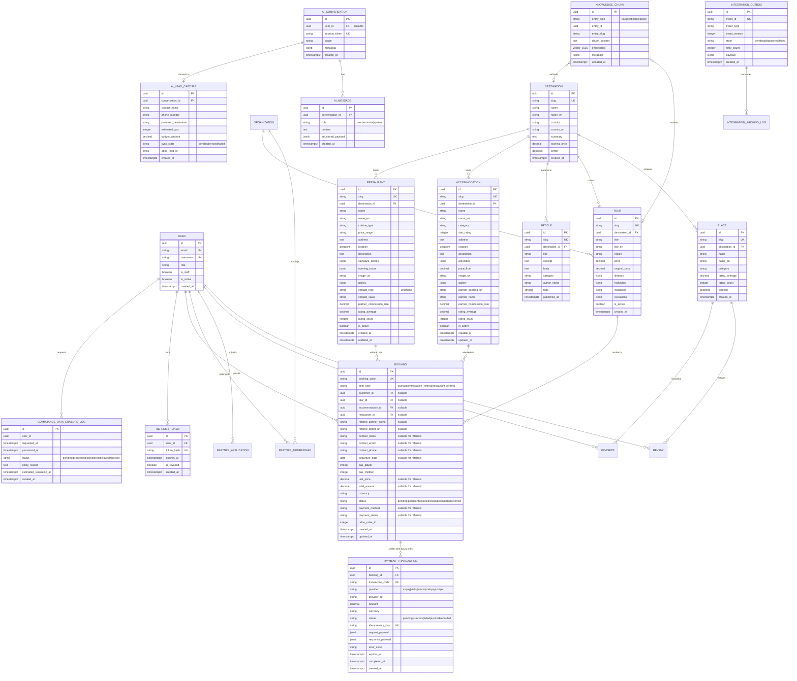
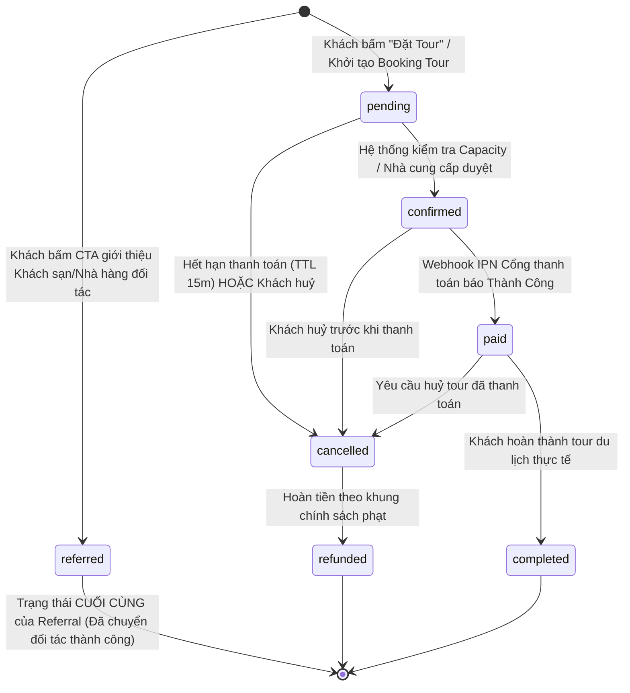

# STAR Travels — Kiến Trúc Backend, Database & Đặc Tả Đồng Bộ ERP Odoo 18 (Backend, Database & ERP Master Spec)

> **Tài liệu hợp nhất:** Chuẩn thiết kế Database Bounded-Context, PostgreSQL Schema, Vector Store, Kế hoạch tích hợp & Đồng bộ Odoo 18 ERP, Cổng thanh toán VNPay & VietQR  
> **Phiên bản:** 2.1.0 (Tháng 10/2026)  
> **Áp dụng cho:** `PostgreSQL 17 + PostGIS + pgvector`, `Django 5.2 ORM`, `Celery + Redis`, `Odoo 18 ERP Core`, `@travel/contracts`, `VNPay 2.1.0`, `VietQR NAPAS 247 EMVCo`  
> **Phạm vi hợp nhất:** Thiết kế Hệ thống Cơ sở dữ liệu & ERD + Đặc tả Kỹ thuật Đồng bộ Hai Chiều Odoo 18 ERP + Hạ tầng Thanh toán Trực tuyến Đa kênh  

---

## 1. Triết Lý Thiết Kế Cơ Sở Dữ Liệu & Ràng Buộc Kỹ Thuật (Design Principles & Invariants)

1. **Khóa chính đồng nhất (Primary Key):**
   - 100% các thực thể nghiệp vụ dùng **UUIDv4** (`uuid_generate_v4()` hoặc Django `UUIDField(default=uuid.uuid4)`).
   - *Lý do:* Ngăn chặn tấn công đoán ID tuần tự (enumeration attack), cho phép sinh ID độc lập ở cả Web, Mobile, AI và Odoo ERP mà không bao giờ bị xung đột ID.
2. **Chuẩn hóa thời gian (Time Standards):**
   - 100% timestamp dùng kiểu **`TIMESTAMPTZ` (UTC)**.
   - Mỗi bảng đều sở hữu 2 trường chuẩn mực: `created_at` (bất biến) và `updated_at` (tự động cập nhật).
3. **Bảo toàn dữ liệu & Lịch sử (Data Integrity & Soft Delete):**
   - Không thực hiện `DELETE` cứng trên các dữ liệu giao dịch, đơn đặt tour, đối tác hoặc lead. Sử dụng `is_active BOOLEAN` hoặc `state VARCHAR(32)` để quản lý vòng đời (State Machine).
   - Ràng buộc khóa ngoại (`FOREIGN KEY`):
     - `ON DELETE PROTECT / RESTRICT` đối với các quan hệ tài chính, đơn hàng, điểm đến có liên kết tour.
     - `ON DELETE CASCADE` chỉ áp dụng cho bảng phụ thuộc mật thiết (ví dụ: các chunk tri thức của 1 tour).
4. **Chiến lược Indexing tối ưu hiệu năng:**
   - **B-Tree Index:** Mặc định cho khóa chính, khóa ngoại, cột tìm kiếm bộ lọc (`slug`, `status`, `price`, `region`).
   - **Unique Index:** Bắt buộc trên các trường định danh (`slug`, `email`, `event_id`, `idempotency_key`, `booking_code`, `transaction_code`).
   - **GiST / SP-GiST Index:** Dành riêng cho tọa độ địa lý không gian PostGIS (`PointField`).
   - **HNSW Index:** Dành cho trường vector embeddings của AI (`vector(1536)`).
   - **GIN Index (trgm):** Phục vụ tìm kiếm mờ (fuzzy search) tiếng Việt trên tên và mô tả.

---

## 2. Sơ Đồ Quan Hệ Thực Thể Tổng Thể (Mermaid ERD)



---

## 3. Chi Tiết Các Bounded Contexts Trong Hệ Thống (8 Bounded Contexts)

### 3.1. Bounded Context 1: Identity & Access Management (IAM)
*Quản lý tài khoản khách hàng, đại lý du lịch (Partner), chuyên viên vận hành (Staff/Admin).*

#### Bảng `accounts_user`
| Cột | Kiểu dữ liệu | Ràng buộc | Mô tả |
| :--- | :--- | :--- | :--- |
| `id` | `UUID` | `PRIMARY KEY, DEFAULT gen_random_uuid()` | Khóa chính chuẩn UUIDv4 |
| `email` | `VARCHAR(255)` | `UNIQUE, NOT NULL` | Email đăng nhập & nhận vé |
| `username` | `VARCHAR(150)` | `UNIQUE, NOT NULL` | Tên người dùng |
| `phone_number` | `VARCHAR(32)` | `NULLABLE` | Số điện thoại / Zalo |
| `role` | `VARCHAR(32)` | `NOT NULL, DEFAULT 'customer'` | `'customer'`, `'partner'`, `'staff'`, `'admin'` |
| `is_staff` | `BOOLEAN` | `NOT NULL, DEFAULT FALSE` | Quyền truy cập Django Admin / Backoffice |
| `is_active` | `BOOLEAN` | `NOT NULL, DEFAULT TRUE` | Trạng thái kích hoạt tài khoản |
| `odoo_partner_id`| `INTEGER` | `NULLABLE, INDEX` | ID liên kết bảng `res.partner` trong Odoo ERP |
| `created_at` | `TIMESTAMPTZ` | `NOT NULL, DEFAULT NOW()` | Thời điểm tạo tài khoản |
| `updated_at` | `TIMESTAMPTZ` | `NOT NULL, DEFAULT NOW()` | Thời điểm cập nhật cuối |

#### Bảng `accounts_refreshtoken`
| Cột | Kiểu dữ liệu | Ràng buộc | Mô tả |
| :--- | :--- | :--- | :--- |
| `id` | `UUID` | `PRIMARY KEY, DEFAULT gen_random_uuid()` | Khóa chính chuẩn UUIDv4 |
| `user_id` | `UUID` | `NOT NULL, FK -> accounts_user` | Tài khoản sở hữu token (`ON DELETE CASCADE`) |
| `token_hash` | `VARCHAR(128)` | `UNIQUE, NOT NULL, INDEX` | Chuỗi SHA-256 hash của refresh token bí mật |
| `jti` | `VARCHAR(64)` | `UNIQUE, NOT NULL, INDEX` | JWT ID định danh duy nhất phiên |
| `ip_address` | `INET` | `NULLABLE` | Địa chỉ IP khởi tạo phiên |
| `user_agent` | `VARCHAR(512)` | `NULLABLE` | Thiết bị / trình duyệt đăng nhập |
| `expires_at` | `TIMESTAMPTZ` | `NOT NULL, INDEX` | Thời điểm hết hạn (mặc định: `NOW() + 7 days`) |
| `is_revoked` | `BOOLEAN` | `NOT NULL, DEFAULT FALSE` | Đánh dấu bị thu hồi khi đăng xuất hoặc xoay vòng |
| `created_at` | `TIMESTAMPTZ` | `NOT NULL, DEFAULT NOW()` | Thời điểm cấp phát |

#### Bảng `compliance_data_erasure_log`
*Nhật ký theo dõi tiến trình tiếp nhận và xử lý yêu cầu xóa/ẩn danh hóa dữ liệu cá nhân theo Nghị định 13/2023/NĐ-CP (SLA 72 giờ làm việc).*

| Cột | Kiểu dữ liệu | Ràng buộc | Mô tả |
| :--- | :--- | :--- | :--- |
| `id` | `UUID` | `PRIMARY KEY, DEFAULT gen_random_uuid()` | Khóa chính chuẩn UUIDv4 |
| `user_id` | `UUID` | `NOT NULL, INDEX` | ID người dùng yêu cầu xóa (không đặt FK CASCADE nhằm bảo toàn log kiểm toán khi user đã ẩn danh) |
| `requested_at` | `TIMESTAMPTZ` | `NOT NULL, DEFAULT NOW()` | Thời điểm nhận yêu cầu qua `POST /api/v1/auth/data-erasure/` |
| `processed_at` | `TIMESTAMPTZ` | `NULLABLE` | Thời điểm hoàn tất xử lý ẩn danh hóa PII |
| `status` | `VARCHAR(32)` | `NOT NULL, DEFAULT 'pending'` | Trạng thái: `'pending'`, `'processing'`, `'completed'`, `'delayed'`, `'rejected'` |
| `delay_reason` | `TEXT` | `NULLABLE` | Lý do trì hoãn (VD: tài khoản còn đơn `bookings_booking` trạng thái `pending_payment`) |
| `estimated_resolution_at` | `TIMESTAMPTZ` | `NULLABLE` | Mốc thời gian dự kiến xử lý tiếp theo |
| `created_at` | `TIMESTAMPTZ` | `NOT NULL, DEFAULT NOW()` | Thời điểm tạo bản ghi log |
| `updated_at` | `TIMESTAMPTZ` | `NOT NULL, DEFAULT NOW()` | Thời điểm cập nhật cuối |

#### 3.1.1. Luồng Xác Thực Chi Tiết: JWT Access/Refresh Token & OAuth 2.0 Social Login
Hệ thống áp dụng mô hình lai **BFF (Backend-for-Frontend) Proxy** kết hợp **Stateless JWT + Stateful Session Invalidation**:

1. **Vòng đời & Lưu trữ Token (Token Lifespan & Storage):**
   - **Access Token:**
     - Thời gian sống: **15 phút** (`access_token_lifetime = 900s`).
     - Thuật toán ký: **RS256** (bất đối xứng qua cặp khóa Private/Public Key) hoặc **HS256** với `JWT_SECRET_KEY` tối thiểu 256-bit trong Secret Manager.
     - Payload tiêu chuẩn: `{ "sub": user.id, "role": user.role, "email": user.email, "jti": uuid4, "exp": timestamp }`.
     - Lưu trữ: Phía client lưu trong memory (React State) hoặc proxy qua Next.js BFF; tuyệt đối **không lưu trong `localStorage` hay `sessionStorage`** để triệt tiêu lỗ hổng XSS.
   - **Refresh Token:**
     - Thời gian sống: **7 ngày** (`refresh_token_lifetime = 604800s`).
     - Cơ chế bảo mật: Lưu trong **HTTP-Only, Secure, SameSite=Lax** Cookie (`__Host-star_refresh_token`). Trình duyệt tự động đính kèm khi gọi `/api/auth/refresh`, Javascript client không thể truy cập.
     - Đồng thời lưu mã băm `token_hash` vào bảng `accounts_refreshtoken` để kiểm soát phiên đăng nhập chủ động.
2. **Cơ chế Xoay Vòng & Thu Hồi Token (Token Rotation & Logout Revocation):**
   - **Refresh Token Rotation (RTR):** Mỗi khi endpoint `/api/v1/auth/token/refresh/` được gọi, refresh token cũ ngay lập tức bị đánh dấu `is_revoked = TRUE` và một cặp Access/Refresh token mới toanh được cấp phát. Nếu phát hiện một token cũ đã revoked bị tái sử dụng, hệ thống kích hoạt cơ chế báo động Breach Detection và thu hồi toàn bộ token của tài khoản đó.
   - **Cơ chế Đăng xuất & Redis Token Blacklist:**
     - Khi người dùng bấm Đăng xuất (`POST /api/v1/auth/logout/`):
       1. Cập nhật `is_revoked = TRUE` cho refresh token trong PostgreSQL.
       2. Lấy định danh `jti` của Access Token hiện tại, đẩy vào **Redis Blacklist Key** (`blacklist:jti:<jti>`) với giá trị TTL bằng chính thời gian sống còn lại của Access Token (tối đa 15 phút).
       3. Middleware `JWTAuthentication` kiểm tra song song tính hợp lệ chữ ký và kiểm tra nhanh trên Redis (`EXISTS blacklist:jti:<jti>`). Nếu tồn tại, lập tức từ chối `401 Unauthorized`.
       4. Xóa cookie `__Host-star_refresh_token` trên trình duyệt.
3. **Đăng nhập Mạng xã hội (OAuth 2.0 Social Login — Google & Facebook):**
   - Hỗ trợ đăng nhập một chạm qua **Google OAuth 2.0** và **Facebook Login** sử dụng luồng Authorization Code Flow with PKCE:
     - **Bước 1 (Frontend):** Khách hàng nhấn *"Tiếp tục với Google"* hoặc *"Tiếp tục với Facebook"* trên trang `/login`. Next.js chuyển hướng sang cổng xác thực OAuth với `client_id`, `redirect_uri = https://startravels.vn/api/auth/callback/google`, `scope = openid email profile`.
     - **Bước 2 (BFF Handler):** Google/Facebook redirect về Next.js Route Handler kèm mã `code`.
     - **Bước 3 (Backend Token Exchange):** Next.js BFF chuyển tiếp code tới Django `POST /api/v1/auth/social/google/`. Django backend gọi trực tiếp Google Token API để lấy `id_token` và UserInfo (Email, Họ tên, Avatar).
     - **Bước 4 (Auto Provisioning & Odoo Binding):**
       - Nếu email đã tồn tại: Liên kết tài khoản mạng xã hội với `accounts_user` hiện có.
       - Nếu tài khoản mới: Tự động khởi tạo `accounts_user` với `role='customer'`, đồng thời phát sinh Outbox event `customer.registered` để tạo `res.partner` tương ứng bên Odoo 18 ERP.
       - Cấp phát cặp JWT Access Token và HTTP-Only Refresh Token Cookie, trả về phản hồi đăng nhập thành công.

#### 3.1.2. Kiến Trúc Giới Hạn Tần Suất Truy Cập (Rate Limiting Architecture)
Để phòng thủ trước tấn công từ chối dịch vụ (DDoS), web scraping tự động và lạm dụng chi phí LLM, hệ thống triển khai kiến trúc **Sliding Window Counter** qua Redis (`django-ratelimit` / custom middleware) với các ngưỡng phân lớp nghiêm ngặt:

| Phân vùng API | Endpoint mục tiêu | Ngưỡng giới hạn (Rate Limit) | Định danh (Key) | Hành động khi vi phạm |
| :--- | :--- | :--- | :--- | :--- |
| **Public Catalog API** (Chống bóc tách dữ liệu / Scraping) | `GET /api/v1/destinations/**`<br>`GET /api/v1/tours/**`<br>`GET /api/v1/places/**` | **60 requests / phút** | Client IP (`request.META['REMOTE_ADDR']`) | Trả về `429 Too Many Requests`, header `Retry-After: 60` |
| **AI Concierge Chat API** (Chống spam gây bùng nổ chi phí LLM) | `POST /api/v1/ai/assistant/chat/` | **10 requests / phút**<br>**50 requests / ngày** | Session Token + Client IP (kết hợp) | Trả về `429 Too Many Requests`. Giao diện hiển thị: *"Quý khách đã sử dụng hết lượt hỏi hôm nay. Vui lòng để lại SĐT hoặc gọi Hotline để được hỗ trợ tức thì."* |
| **Lead / Inquiry / Partner Form** (Chống spam form rác & bot) | `POST /api/v1/inquiries/**`<br>`POST /api/v1/partners/**` | **5 requests / phút** | Client IP | **Bắt buộc đính kèm Cloudflare Turnstile / reCAPTCHA v3 token**. Nếu vi phạm hoặc điểm bot cao (>0.7), từ chối ngay lập tức và ghi log bảo mật |
| **Auth Endpoints** (Chống Brute Force mật khẩu) | `POST /api/v1/auth/login/`<br>`POST /api/v1/auth/register/` | **5 requests / phút**<br>**20 requests / giờ** | Client IP + Target Email | Khóa tạm thời endpoint đối với IP đó trong 15 phút, gửi email cảnh báo đăng nhập bất thường |

---

### 3.2. Bounded Context 2: Travel Catalog & Experiences (CMS / Kho Tour)
*Quản lý Điểm đến, Danh thắng, Tour du lịch trọn gói và Lịch trình chi tiết.*

#### Bảng `destinations_destination`
| Cột | Kiểu dữ liệu | Ràng buộc | Mô tả |
| :--- | :--- | :--- | :--- |
| `id` | `UUID` | `PRIMARY KEY` | Khóa chính |
| `slug` | `VARCHAR(128)` | `UNIQUE, NOT NULL, INDEX` | Định danh URL (ví dụ: `ha-long`, `da-lat`) |
| `name` | `VARCHAR(255)` | `NOT NULL` | Tên điểm đến tiếng Việt |
| `name_en` | `VARCHAR(255)` | `NULLABLE` | Tên điểm đến tiếng Anh |
| `country` | `VARCHAR(128)` | `NOT NULL` | Tỉnh/thành, quốc gia tiếng Việt |
| `country_en` | `VARCHAR(128)` | `NULLABLE` | Tỉnh/thành, quốc gia tiếng Anh |
| `summary` | `TEXT` | `NOT NULL` | Giới thiệu ngắn |
| `summary_en` | `TEXT` | `NULLABLE` | Giới thiệu ngắn tiếng Anh |
| `image_url` | `VARCHAR(512)` | `NOT NULL` | Ảnh đại diện thumbnail |
| `hero_image_url`| `VARCHAR(512)` | `NOT NULL` | Ảnh bìa banner độ phân giải cao |
| `starting_price`| `NUMERIC(12,2)`| `NULLABLE` | Giá khởi điểm tham khảo (VNĐ) |
| `center` | `GEOMETRY(Point, 4326)` | `NULLABLE, SPATIAL INDEX` | Tọa độ GPS trung tâm (WGS84) |
| `is_active` | `BOOLEAN` | `NOT NULL, DEFAULT TRUE` | Trạng thái hiển thị công khai |

#### Bảng `places_place` (Danh thắng / Trải nghiệm bản địa)
| Cột | Kiểu dữ liệu | Ràng buộc | Mô tả |
| :--- | :--- | :--- | :--- |
| `id` | `UUID` | `PRIMARY KEY` | Khóa chính |
| `slug` | `VARCHAR(128)` | `UNIQUE, NOT NULL, INDEX` | URL slug |
| `destination_id`| `UUID` | `NOT NULL, FK -> destinations` | Thuộc điểm đến nào (`ON DELETE PROTECT`) |
| `name` | `VARCHAR(255)` | `NOT NULL` | Tên danh lam thắng cảnh |
| `name_en` | `VARCHAR(255)` | `NULLABLE` | Tên tiếng Anh |
| `category` | `VARCHAR(64)` | `NOT NULL, INDEX` | `'natural'`, `'culture'`, `'culinary'`, `'adventure'` |
| `location` | `GEOMETRY(Point, 4326)` | `NULLABLE, SPATIAL INDEX` | Vị trí GPS chính xác |
| `rating_average`| `NUMERIC(3,2)` | `NOT NULL, DEFAULT 5.00` | Điểm đánh giá trung bình (1.00 – 5.00) |
| `rating_count` | `INTEGER` | `NOT NULL, DEFAULT 0` | Tổng số lượt đánh giá |

#### Bảng `tours_tour` (Tour du lịch trọn gói chuẩn Odoo Sync)
| Cột | Kiểu dữ liệu | Ràng buộc | Mô tả |
| :--- | :--- | :--- | :--- |
| `id` | `UUID` | `PRIMARY KEY` | Khóa chính |
| `slug` | `VARCHAR(128)` | `UNIQUE, NOT NULL, INDEX` | URL slug (ví dụ: `ha-long-2n1d`) |
| `odoo_product_id`| `INTEGER` | `NULLABLE, INDEX` | ID liên kết `product.template` trong Odoo |
| `destination_id`| `UUID` | `NULLABLE, FK -> destinations` | Điểm đến trọng tâm |
| `title` | `VARCHAR(255)` | `NOT NULL` | Tên tour tiếng Việt |
| `title_en` | `VARCHAR(255)` | `NULLABLE` | Tên tour tiếng Anh |
| `region` | `VARCHAR(16)` | `NOT NULL, INDEX` | Phân vùng: `'north'`, `'central'`, `'south'` |
| `duration` | `VARCHAR(64)` | `NOT NULL` | Thời lượng (ví dụ: "2 Ngày 1 Đêm") |
| `duration_en` | `VARCHAR(64)` | `NULLABLE` | Thời lượng tiếng Anh ("2 Days 1 Night") |
| `departure` | `VARCHAR(128)` | `NOT NULL` | Điểm khởi hành (ví dụ: "Hà Nội") |
| `price` | `NUMERIC(12,2)`| `NOT NULL, INDEX` | Giá vé người lớn (VNĐ) |
| `original_price`| `NUMERIC(12,2)`| `NULLABLE` | Giá gốc trước khi giảm |
| `image_url` | `VARCHAR(512)` | `NOT NULL` | Ảnh đại diện chính |
| `gallery` | `JSONB` | `NOT NULL, DEFAULT '[]'` | Bộ sưu tập ảnh thực tế |
| `itinerary` | `JSONB` | `NOT NULL, DEFAULT '[]'` | Lịch trình theo ngày (`[{day, title, morning...}]`) |
| `highlights` | `JSONB` | `NOT NULL, DEFAULT '[]'` | Danh sách điểm nhấn trải nghiệm |
| `inclusions` | `JSONB` | `NOT NULL, DEFAULT '[]'` | Dịch vụ đã bao gồm trong tour |
| `exclusions` | `JSONB` | `NOT NULL, DEFAULT '[]'` | Dịch vụ không bao gồm |
| `featured` | `BOOLEAN` | `NOT NULL, DEFAULT FALSE` | Đánh dấu tour nổi bật trang chủ |
| `is_active` | `BOOLEAN` | `NOT NULL, DEFAULT TRUE` | Còn mở bán / Đã ngưng |

#### Bảng `accommodations_accommodation` (Khách Sạn & Khu Nghỉ Dưỡng — Mô Hình Referral)
| Cột | Kiểu dữ liệu | Ràng buộc | Mô tả |
| :--- | :--- | :--- | :--- |
| `id` | `UUID` | `PRIMARY KEY, DEFAULT gen_random_uuid()` | Khóa chính chuẩn UUIDv4 |
| `slug` | `VARCHAR(128)` | `UNIQUE, NOT NULL, INDEX` | URL định danh khách sạn |
| `destination_id` | `UUID` | `NOT NULL, FK -> destinations` | Thuộc điểm đến nào (`ON DELETE RESTRICT`) |
| `name` | `VARCHAR(255)` | `NOT NULL` | Tên khách sạn tiếng Việt |
| `name_en` | `VARCHAR(255)` | `NULLABLE` | Tên khách sạn tiếng Anh |
| `category` | `VARCHAR(32)` | `NOT NULL` | Phân loại lưu trú (`'heritage_hotel'`, `'beach_resort'`, `'boutique_luxury'`) |
| `star_rating` | `SMALLINT` | `NULLABLE` | Hạng sao (1 - 5 sao) |
| `address` | `TEXT` | `NOT NULL` | Địa chỉ thực tế |
| `location` | `GEOMETRY(Point, 4326)` | `NULLABLE, SPATIAL INDEX` | Tọa độ GPS |
| `description` | `TEXT` | `NULLABLE` | Mô tả tổng quan tiếng Việt |
| `description_en` | `TEXT` | `NULLABLE` | Mô tả tổng quan tiếng Anh |
| `amenities` | `JSONB` | `NOT NULL, DEFAULT '[]'` | Danh sách tiện ích |
| `price_from` | `NUMERIC(12,2)` | `NULLABLE` | Giá khởi điểm tham khảo (VNĐ/đêm) |
| `image_url` | `VARCHAR(512)` | `NOT NULL` | Ảnh đại diện chính |
| `gallery` | `JSONB` | `NOT NULL, DEFAULT '[]'` | Bộ sưu tập ảnh thực tế |
| `partner_booking_url` | `VARCHAR(512)` | `NOT NULL` | URL dẫn khách sang nền tảng đặt phòng đối tác |
| `partner_name` | `VARCHAR(128)` | `NULLABLE` | Tên đối tác (Booking.com, Agoda, Traveloka) |
| `partner_commission_rate` | `NUMERIC(5,2)` | `NULLABLE` | % hoa hồng giới thiệu thỏa thuận |
| `rating_average` | `NUMERIC(3,2)` | `NOT NULL, DEFAULT 5.00` | Điểm đánh giá (1.00 – 5.00) |
| `rating_count` | `INTEGER` | `NOT NULL, DEFAULT 0` | Số lượt đánh giá |
| `is_active` | `BOOLEAN` | `NOT NULL, DEFAULT TRUE` | Trạng thái hiển thị |
| `created_at` | `TIMESTAMPTZ` | `NOT NULL, DEFAULT NOW()` | Thời điểm tạo |
| `updated_at` | `TIMESTAMPTZ` | `NOT NULL, DEFAULT NOW()` | Thời điểm cập nhật cuối |

*Index tối ưu:* `CREATE INDEX idx_accommodation_destination ON accommodations_accommodation(destination_id, is_active);`

#### Bảng `restaurants_restaurant` (Nhà Hàng & Ẩm Thực — Mô Hình Referral)
| Cột | Kiểu dữ liệu | Ràng buộc | Mô tả |
| :--- | :--- | :--- | :--- |
| `id` | `UUID` | `PRIMARY KEY, DEFAULT gen_random_uuid()` | Khóa chính chuẩn UUIDv4 |
| `slug` | `VARCHAR(128)` | `UNIQUE, NOT NULL, INDEX` | URL định danh nhà hàng |
| `destination_id` | `UUID` | `NOT NULL, FK -> destinations` | Thuộc điểm đến nào (`ON DELETE RESTRICT`) |
| `name` | `VARCHAR(255)` | `NOT NULL` | Tên nhà hàng tiếng Việt |
| `name_en` | `VARCHAR(255)` | `NULLABLE` | Tên nhà hàng tiếng Anh |
| `cuisine_type` | `VARCHAR(64)` | `NOT NULL` | Phong vị ẩm thực (`'contemporary_vietnamese'`, `'traditional_northern'`, v.v.) |
| `price_range` | `VARCHAR(16)` | `NOT NULL` | Phân khúc giá: `'$$'`, `'$$$'`, `'$$$$'` |
| `address` | `TEXT` | `NOT NULL` | Địa chỉ nhà hàng |
| `location` | `GEOMETRY(Point, 4326)` | `NULLABLE, SPATIAL INDEX` | Tọa độ GPS |
| `description` | `TEXT` | `NULLABLE` | Giới thiệu không gian & phong vị |
| `description_en` | `TEXT` | `NULLABLE` | Giới thiệu tiếng Anh |
| `signature_dishes` | `JSONB` | `NOT NULL, DEFAULT '[]'` | Danh sách món ăn đặc trưng |
| `opening_hours` | `JSONB` | `NOT NULL, DEFAULT '{}'` | Giờ mở cửa |
| `image_url` | `VARCHAR(512)` | `NOT NULL` | Ảnh đại diện chính |
| `gallery` | `JSONB` | `NOT NULL, DEFAULT '[]'` | Bộ sưu tập ảnh thực tế |
| `contact_type` | `VARCHAR(16)` | `NOT NULL` | Loại hình liên hệ: `'url'`, `'phone'` |
| `contact_value` | `VARCHAR(512)` | `NOT NULL` | Giá trị liên hệ (URL đặt bàn hoặc số hotline `tel:+84...`) |
| `partner_commission_rate` | `NUMERIC(5,2)` | `NULLABLE` | % hoa hồng thỏa thuận |
| `rating_average` | `NUMERIC(3,2)` | `NOT NULL, DEFAULT 5.00` | Điểm đánh giá (1.00 – 5.00) |
| `rating_count` | `INTEGER` | `NOT NULL, DEFAULT 0` | Số lượt đánh giá |
| `is_active` | `BOOLEAN` | `NOT NULL, DEFAULT TRUE` | Trạng thái hiển thị |
| `created_at` | `TIMESTAMPTZ` | `NOT NULL, DEFAULT NOW()` | Thời điểm tạo |
| `updated_at` | `TIMESTAMPTZ` | `NOT NULL, DEFAULT NOW()` | Thời điểm cập nhật cuối |

*Index tối ưu:* `CREATE INDEX idx_restaurant_destination ON restaurants_restaurant(destination_id, is_active);`

---

### 3.3. Bounded Context 3: Editorial & Community
- **Bảng `content_article` (Bài viết / Cẩm nang / Stories):** `id` (UUID PK), `slug` (UK), `title`, `title_en`, `excerpt`, `body`, `cover_image`, `category`, `author_name`, `author_role`, `read_time`, `tags` (JSONB), `destination_id` (FK).
- **Bảng `reviews_review`:** `id` (UUID PK), `user_id` (FK), `place_id` (FK), `rating` (1–5), `comment` (TEXT), `created_at`.
- **Bảng `places_favorite`:** `id` (UUID PK), `user_id` (FK), `place_id` (FK), `created_at`. `UNIQUE(user_id, place_id)`.

---

### 3.4. Bounded Context 4: Bookings & Payments (Giao Dịch Đặt Chỗ & Thanh Toán Trực Tuyến)
*Quản lý vòng đời đơn đặt tour, giao dịch cổng thanh toán trực tuyến, đối soát tài chính, hoàn tiền và xuất hóa đơn điện tử.*

#### Bảng `bookings_booking` (Lõi Giao Dịch Đặt Chỗ & Referral Tracking)
| Cột | Kiểu dữ liệu | Ràng buộc | Mô tả |
| :--- | :--- | :--- | :--- |
| `id` | `UUID` | `PRIMARY KEY, DEFAULT gen_random_uuid()` | Khóa chính chuẩn UUIDv4 |
| `booking_code` | `VARCHAR(32)` | `UNIQUE, NOT NULL, INDEX` | Mã đặt chỗ / tracking code (`ST-XXXX` hoặc `REF-ACC-XXXX`, `REF-RES-XXXX`) |
| `item_type` | `VARCHAR(32)` | `NOT NULL, DEFAULT 'tour', INDEX` | Phân loại: `'tour'`, `'accommodation_referral'`, `'restaurant_referral'` |
| `customer_id` | `UUID` | `NULLABLE, FK -> accounts_user` | Khách hàng đặt tour / referral (`ON DELETE SET NULL`) |
| `tour_id` | `UUID` | `NULLABLE, FK -> tours_tour` | Tour được chọn (`ON DELETE PROTECT`, NULL nếu là referral) |
| `accommodation_id` | `UUID` | `NULLABLE, FK -> accommodations_accommodation` | Khách sạn được giới thiệu (`ON DELETE SET NULL`) |
| `restaurant_id` | `UUID` | `NULLABLE, FK -> restaurants_restaurant` | Nhà hàng được giới thiệu (`ON DELETE SET NULL`) |
| `referral_partner_name` | `VARCHAR(128)` | `NULLABLE` | Tên đối tác tiếp nhận referral (`'Booking.com'`, `'Agoda'`, tên nhà hàng) |
| `referral_target_url` | `VARCHAR(512)` | `NULLABLE` | URL thực tế đã redirect khách sang nền tảng đối tác |
| `travel_date` | `DATE` | `NULLABLE, INDEX` | Ngày khởi hành dự kiến (tour) |
| `adult_count` | `INTEGER` | `NOT NULL, DEFAULT 1` | Số lượng khách người lớn (>= 1) |
| `child_count` | `INTEGER` | `NOT NULL, DEFAULT 0` | Số lượng trẻ em (từ 5 - 11 tuổi) |
| `infant_count` | `INTEGER` | `NOT NULL, DEFAULT 0` | Số lượng em bé (< 5 tuổi) |
| `adult_price` | `NUMERIC(12,2)`| `NULLABLE` | Đơn giá người lớn tại thời điểm chốt (NULL với referral) |
| `child_price` | `NUMERIC(12,2)`| `NOT NULL, DEFAULT 0` | Đơn giá trẻ em tại thời điểm chốt |
| `total_amount` | `NUMERIC(12,2)`| `NULLABLE` | Tổng tiền thanh toán (NULL với referral — phân biệt rõ với đơn 0 VNĐ) |
| `contact_name` | `VARCHAR(255)` | `NULLABLE` | Họ tên người liên hệ (chỉ điền nếu khách tự nguyện điền form tư vấn) |
| `contact_phone`| `VARCHAR(32)` | `NULLABLE` | Số điện thoại nhận tư vấn/vé |
| `contact_email`| `VARCHAR(255)` | `NULLABLE` | Email nhận xác nhận và hóa đơn |
| `special_requests` | `TEXT` | `NULLABLE` | Yêu cầu riêng (ăn chay, phòng đơn, đón sân bay...) |
| `status` | `VARCHAR(32)` | `NOT NULL, DEFAULT 'pending', INDEX` | Vòng đời đơn: `'pending'`, `'confirmed'`, `'paid'`, `'cancelled'`, `'completed'`, `'referred'` |
| `payment_method` | `VARCHAR(32)` | `NULLABLE, DEFAULT 'vnpay'` | Cổng thanh toán (NULL với referral) |
| `payment_status` | `VARCHAR(32)` | `NULLABLE, DEFAULT 'unpaid', INDEX`| Trạng thái thanh toán (NULL với referral) |
| `odoo_sale_order_id`| `INTEGER` | `NULLABLE, INDEX` | ID liên kết đơn hàng `sale.order` trong Odoo 18 |
| `cancellation_reason`| `TEXT` | `NULLABLE` | Lý do huỷ tour khi chuyển sang `cancelled` |
| `cancelled_at` | `TIMESTAMPTZ` | `NULLABLE` | Thời điểm huỷ tour |
| `refund_amount`| `NUMERIC(12,2)`| `NOT NULL, DEFAULT 0` | Số tiền hoàn trả khách sau khi trừ phí huỷ |
| `refunded_at` | `TIMESTAMPTZ` | `NULLABLE` | Thời điểm hoàn tất hoàn tiền |
| `created_at` | `TIMESTAMPTZ` | `NOT NULL, DEFAULT NOW()` | Thời điểm tạo đơn |
| `updated_at` | `TIMESTAMPTZ` | `NOT NULL, DEFAULT NOW()` | Thời điểm cập nhật cuối |

*Index bổ sung:* `CREATE INDEX idx_booking_type_stat_dt ON bookings_booking(item_type, status, created_at);`

#### Bảng `payments_payment_transaction` (Nhật Ký Giao Dịch Thanh Toán)
| Cột | Kiểu dữ liệu | Ràng buộc | Mô tả |
| :--- | :--- | :--- | :--- |
| `id` | `UUID` | `PRIMARY KEY, DEFAULT gen_random_uuid()` | Khóa chính chuẩn UUIDv4 |
| `booking_id` | `UUID` | `NOT NULL, FK -> bookings_booking`| Đơn đặt chỗ tương ứng (`ON DELETE PROTECT`) |
| `transaction_code` | `VARCHAR(64)` | `UNIQUE, NOT NULL, INDEX` | Mã giao dịch nội bộ sinh ra trước khi redirect (`vnp_TxnRef`) |
| `provider` | `VARCHAR(32)` | `NOT NULL, INDEX` | Cổng thanh toán: `'vnpay'`, `'vietqr'`, `'momo'`, `'zalopay'`, `'stripe'` |
| `provider_ref` | `VARCHAR(128)` | `NULLABLE, INDEX` | Mã tham chiếu phía cổng (vd: `vnp_TransactionNo`, `transId`) |
| `amount` | `NUMERIC(12,2)`| `NOT NULL` | Số tiền thực tế gửi sang cổng thanh toán |
| `currency` | `VARCHAR(8)` | `NOT NULL, DEFAULT 'VND'` | Đơn vị tiền tệ (`'VND'`, `'USD'`) |
| `status` | `VARCHAR(32)` | `NOT NULL, DEFAULT 'pending', INDEX` | `'pending'`, `'success'`, `'failed'`, `'expired'`, `'refunded'` |
| `idempotency_key` | `VARCHAR(128)` | `UNIQUE, NOT NULL, INDEX` | Khóa chống xử lý lặp lại webhook |
| `request_payload` | `JSONB` | `NOT NULL, DEFAULT '{}'` | Tham số truyền đi cổng |
| `response_payload`| `JSONB` | `NOT NULL, DEFAULT '{}'` | Toàn bộ dữ liệu callback/IPN trả về từ cổng |
| `error_code` | `VARCHAR(64)` | `NULLABLE` | Mã lỗi cổng trả về khi thất bại |
| `created_at` | `TIMESTAMPTZ` | `NOT NULL, DEFAULT NOW(), INDEX` | Thời điểm khởi tạo giao dịch |
| `completed_at` | `TIMESTAMPTZ` | `NULLABLE` | Thời điểm thanh toán thành công |
| `expires_at` | `TIMESTAMPTZ` | `NULLABLE, INDEX` | Thời điểm hết hạn giao dịch (mặc định 15 phút) |

> **RÀNG BUỘC NGHIỆP VỤ REFERRAL:** Tuyệt đối **KHÔNG tạo bản ghi `payments_payment_transaction`** cho các đơn `accommodation_referral` và `restaurant_referral`. Không tích hợp VNPay hay VietQR cho luồng này do STAR Travels đóng vai trò cẩm nang kết nối, không xử lý dòng tiền trực tiếp.

#### 3.4.1. Cỗ Máy Trạng Thái Đặt Chỗ (Booking State Machine)



- **Quy tắc chuyển trạng thái (State Transition Invariants):**
  1. `[*] -> referred`: Tạo trực tiếp khi khách click CTA trên thẻ Khách sạn/Nhà hàng hoặc AI Concierge. Lưu lại `referral_partner_name` và `referral_target_url`. Không sinh transaction thanh toán.
  2. `pending -> confirmed`: Tự động trong 5 giây nếu tour còn chỗ trống mở bán (Capacity Quota Check), hoặc sau khi điều phối viên xác nhận lịch xe/tàu.
  3. `confirmed -> paid`: CHỈ ĐƯỢC CHUYỂN sau khi nhận được Webhook IPN hợp lệ với chữ ký số chuẩn xác từ cổng thanh toán và số tiền khớp 100% với `total_amount`. Đồng thời kích hoạt Outbox event `booking.paid` để tạo `sale.order` trạng thái confirmed trên Odoo 18.
  4. `paid -> cancelled -> refunded`: Chuyển sang trạng thái huỷ chỉ khi quản trị viên hoặc khách gửi yêu cầu hợp lệ. Kích hoạt tính toán khấu trừ phạt và gọi API hoàn tiền.

#### 3.4.2. Luồng Tích Hợp Cổng Thanh Toán, Webhook IPN & Xử Lý Idempotency

Hệ thống hỗ trợ 4 phương thức thanh toán chính:
- **VNPay:** Thẻ ATM nội địa (Napas), Quét mã VNPay-QR, Thẻ thanh toán quốc tế.
- **MoMo:** Ứng dụng MoMo, Ví điện tử, Quét mã MoMo QR.
- **ZaloPay:** Ví ZaloPay, QR code tương thích đa ngân hàng.
- **Stripe:** Dành cho thẻ tín dụng quốc tế (Visa, Mastercard, JCB, American Express) của du khách nước ngoài và kiều bào.

```
┌──────────────┐          ┌────────────────┐          ┌────────────────┐          ┌────────────────┐
│   Customer   │          │   Public Site  │          │ Django Backend │          │ Payment Gateway│
│   (Browser)  │          │   (Next.js 15) │          │ (apps/api)     │          │ (VNPay/MoMo)   │
└──────┬───────┘          └───────┬────────┘          └───────┬────────┘          └───────┬────────┘
       │ 1. Chọn ngày & Đặt tour  │                           │                           │
       ├─────────────────────────>│                           │                           │
       │                          │ 2. POST /api/v1/bookings/ │                           │
       │                          ├──────────────────────────>│                           │
       │                          │                           │ 3. Tạo Booking 'pending'  │
       │                          │                           │    & Sinh URL thanh toán  │
       │                          │<──────────────────────────┤                           │
       │ 4. Redirect cổng TT      │  Trả về payment_url       │                           │
       ├─────────────────────────────────────────────────────────────────────────────────>│
       │                          │                           │                           │
       │ 5. Khách quét mã QR / Nhập thẻ & Xác thực OTP        │                           │
       │─────────────────────────────────────────────────────────────────────────────────>│
       │                          │                           │                           │
       │                          │                           │ 6. Server-to-Server IPN   │
       │                          │                           │<──────────────────────────┤
       │                          │                           │    (Kèm Signature SHA)    │
       │                          │                           │ 7. Xác thực chữ ký số     │
       │                          │                           │    & Khóa DB Idempotency  │
       │                          │                           │ 8. Update status='paid'   │
       │                          │                           │    & Push Outbox Event    │
       │                          │                           ├──────────────────────────>│
       │ 9. Trình duyệt quay về Return URL                    │  Trả về HTTP 200 (Success)│
       │<─────────────────────────────────────────────────────────────────────────────────┤
       │ 10. Chuyển hướng /booking/success/{code}             │                           │
       │─────────────────────────>│                           │                           │
```

- **Xác thực Chữ ký số Webhook IPN (HMAC Signature Verification):**
  - **VNPay IPN (`GET /api/v1/payments/vnpay/ipn/`):**
    - Sắp xếp toàn bộ tham số nhận được theo thứ tự alphabet (loại bỏ `vnp_SecureHash` và `vnp_SecureHashType`).
    - Tính toán mã băm HMAC-SHA512 với `VNPAY_HASH_SECRET` được lưu an toàn trong Secret Manager.
    - So sánh an toàn thời gian thực (`hmac.compare_digest(calculated_hash, vnp_SecureHash)`).
  - **MoMo IPN (`POST /api/v1/payments/momo/ipn/`):**
    - Tạo chuỗi raw data theo chuẩn MoMo: `accessKey=...&amount=...&extraData=...&message=...&orderId=...&orderInfo=...&orderType=...&partnerCode=...&payType=...&requestId=...&responseTime=...&resultCode=...&transId=...`.
    - Tính HMAC-SHA256 với `MOMO_SECRET_KEY` và so sánh với trường `signature`.
- **Cơ chế Xử Lý Chống Trùng Lặp (Idempotency Handling):**
  - Webhook của các cổng thanh toán có cơ chế tự động gửi lại nhiều lần nếu chưa nhận được phản hồi 200 (hoặc do mạng chập chờn).
  - Django xử lý trong khối giao dịch nguyên tử (`transaction.atomic()`):
    ```python
    # Khóa dòng booking tránh race condition
    booking = Booking.objects.select_for_update().get(booking_code=order_id)
    
    # Kiểm tra nếu booking đã ở trạng thái 'paid'
    if booking.status == BookingStatus.PAID:
        return JsonResponse({"RspCode": "02", "Message": "Order already confirmed"})
    
    # Ghi nhận transaction với khóa duy nhất idempotency_key
    txn, created = PaymentTransaction.objects.get_or_create(
        idempotency_key=f"{provider}:{provider_ref}",
        defaults={
            "booking": booking,
            "provider": provider,
            "provider_ref": provider_ref,
            "amount": amount,
            "status": "success",
            "response_payload": request_data,
        }
    )
    if not created:
        return JsonResponse({"RspCode": "02", "Message": "Transaction already processed"})
        
    booking.status = BookingStatus.PAID
    booking.payment_status = PaymentStatus.CAPTURED
    booking.save(update_fields=['status', 'payment_status', 'updated_at'])
    
    # Phát sinh sự kiện Outbox đồng bộ Odoo
    OutboxEvent.objects.create(
        event_type="booking.paid",
        payload={"booking_code": booking.booking_code, "amount": float(booking.total_amount)}
    )
    ```

#### 3.4.2.1. Danh Mục API Endpoints Thanh Toán (Payment API Contracts)

Hệ thống cung cấp 3 endpoint chuẩn hóa phục vụ đa cổng thanh toán (VNPay & VietQR):

##### 1. Khởi tạo giao dịch thanh toán: `POST /api/v1/payments/create/`
- **Mục đích:** Tạo giao dịch `payments_transaction` ở trạng thái `pending` và sinh payload thanh toán (VNPay URL hoặc VietQR NAPAS payload).
- **Request Body:**
  ```json
  {
    "booking_code": "ST-202610-A89F",
    "gateway": "vietqr", // hoặc "vnpay"
    "bank_code": "", // tùy chọn cho VNPay
    "locale": "vn"
  }
  ```
- **Response `gateway="vietqr"` (201 Created):**
  ```json
  {
    "payment_id": "9b1deb4d-3b7d-4bad-9bdd-2b0d7b3dcb6d",
    "transaction_code": "ST-202610-A89F_1728400000",
    "booking_code": "ST-202610-A89F",
    "amount": "3500000.00",
    "currency": "VND",
    "gateway": "vietqr",
    "status": "pending",
    "expires_at": "2026-10-08T19:15:00+07:00",
    "qr_code_url": "https://img.vietqr.io/image/970422-0987654321-compact2.png?amount=3500000&addInfo=ST-202610-A89F&accountName=CONG+TY+TNHH+STAR+TRAVELS+VIET+NAM",
    "emvco_payload": "00020101021238540010A00000072701240006970422011009876543210208QRIBFTTA5303704540735000005802VN62180814ST-202610-A89F6304C689",
    "bank_info": {
      "bank_name": "MBBank",
      "bank_bin": "970422",
      "account_number": "0987654321",
      "account_name": "CONG TY TNHH STAR TRAVELS VIET NAM",
      "amount": 3500000,
      "transfer_content": "ST-202610-A89F"
    }
  }
  ```
- **Response `gateway="vnpay"` (201 Created):**
  Trực tiếp trả về `payment_url` chuyển hướng sang sandbox VNPay.

##### 2. Polling kiểm tra trạng thái thanh toán: `GET /api/v1/payments/{id}/status/`
- **Mục đích:** Frontend polling định kỳ mỗi 5 giây để kiểm tra trạng thái giao dịch (`id` là UUID giao dịch hoặc `transaction_code`).
- **Response (200 OK):**
  ```json
  {
    "payment_id": "9b1deb4d-3b7d-4bad-9bdd-2b0d7b3dcb6d",
    "transaction_code": "ST-202610-A89F_1728400000",
    "booking_code": "ST-202610-A89F",
    "state": "pending", // "pending" | "success" | "failed" | "expired"
    "status": "pending",
    "amount": "3500000.00",
    "currency": "VND",
    "gateway": "vietqr",
    "is_paid": false,
    "expires_at": "2026-10-08T19:15:00+07:00",
    "created_at": "2026-10-08T19:00:00+07:00",
    "completed_at": null
  }
  ```
- **Cơ chế tự động:** Nếu `state='pending'` và thời gian hiện tại vượt quá `expires_at`, endpoint tự động cập nhật `state='expired'`. Đồng thời Celery Beat periodic task `payments.tasks.sweep_expired_payments` quét mỗi phút để dọn dẹp các giao dịch quá hạn.

##### 3. Xác nhận thanh toán VietQR từ Odoo ERP: `POST /api/v1/payments/{id}/vietqr-confirm/`
- **Mục đích:** Endpoint NỘI BỘ bảo mật cao để Odoo 18 ERP (Kế toán duyệt thủ công hoặc hệ thống biến động số dư SePay/Casso) gọi về cập nhật trạng thái đơn hàng khi đã nhận được tiền vào tài khoản ngân hàng công ty.
- **Bảo mật:** Bắt buộc có chữ ký `X-Signature-SHA256` tính bằng HMAC-SHA256(raw_body, `ODOO_WEBHOOK_SECRET`). Thiếu hoặc sai chữ ký $\rightarrow$ Trả `HTTP 401 Unauthorized`.
- **Request Headers:**
  - `Content-Type: application/json`
  - `X-Signature-SHA256: <hex_encoded_hmac_sha256>`
  - `X-Idempotency-Key: <unique_key>`
- **Request Body:**
  ```json
  {
    "payment_id": "9b1deb4d-3b7d-4bad-9bdd-2b0d7b3dcb6d",
    "confirmed_by": "ketoan_vien_01",
    "confirmed_at": "2026-10-08T19:05:00Z",
    "amount_confirmed": 3500000,
    "source": "manual_odoo_ui" // hoặc "sepay_webhook"
  }
  ```
- **Xử lý nghiệp vụ:**
  1. Verify chữ ký HMAC-SHA256 $\rightarrow$ Sai trả 401.
  2. Khóa dòng bản ghi bằng `select_for_update()`.
  3. Kiểm tra Idempotency: Nếu đã `success` $\rightarrow$ Trả `already_confirmed` (HTTP 200), không xử lý lại.
  4. Nếu `amount_confirmed != amount` $\rightarrow$ Ghi log warning rõ ràng, chấp nhận kết quả theo quyết định kế toán bên Odoo.
  5. Cập nhật `payments_transaction.status = 'success'`, `bookings_booking.status = 'paid'`, `payment_status = 'captured'`, `payment_method = 'vietqr'`.
  6. Ghi nhận sự kiện Outbox `booking.paid` cho Celery worker.
  7. Trả về `{"status": "success", "message": "Xác nhận thanh toán VietQR thành công."}`.

##### 4. Bộ Kiểm Thử Đặc Tả Thanh Toán Độc Lập (Automated Payment Spec Verification Suites)

Nhằm đảm bảo 100% tuân thủ các chuẩn giao thức quốc tế và quốc gia (VNPay 2.1.0 & NAPAS 247 EMVCo), hệ thống cung cấp 2 bộ kiểm thử độc lập không phụ thuộc database:

1. **Kiểm thử đặc tả VNPay (`python apps/api/payments/verify_vnpay_spec.py`):**
   - Sắp xếp thứ tự alphabetic chuẩn xác các tham số URL.
   - Định dạng chuẩn thời gian UTC+7 (`vnp_CreateDate`, `vnp_ExpireDate` = +15m).
   - Mã hóa chuẩn `quote_plus` và tạo chữ ký HMAC-SHA512.
   - Xác minh toàn bộ mã phản hồi IPN: `97` (Invalid Checksum), `01` (Order Not Found), `04` (Invalid Amount), `02` (Order Already Confirmed), `00` (Payment Success & Outbox dispatch).
   - Bảo toàn trạng thái `pending_payment` cho booking khi giao dịch thanh toán thất bại để khách có thể thử lại.

2. **Kiểm thử đặc tả VietQR & EMVCo (`python apps/api/payments/verify_vietqr_spec.py`):**
   - Thuật toán CRC16-CCITT (đa thức 0x1021, giá trị khởi tạo 0xFFFF, chuẩn EMVCo).
   - Định dạng chuỗi payload NAPAS 247 (Tag 00, 01, 38, 53, 54, 58, 62, 63).
   - Sinh URL ảnh QuickLink (`img.vietqr.io`).
   - Xác thực chữ ký HMAC-SHA256 (`X-Signature-SHA256`) từ Odoo ERP webhook.
   - Xử lý Idempotency và cơ chế quét dọn giao dịch quá hạn (`sweep_expired_payments`).

#### 3.4.3. Đặc Tả API Ghi Nhận Referral & Lead Tracking (`POST /api/v1/referrals/track/`)

- **Bối cảnh & Mục đích nghiệp vụ:**
  - Đối với Khách Sạn (Accommodations) và Nhà Hàng (Restaurants), STAR Travels vận hành theo mô hình **Giới thiệu + Dẫn link đối tác (Affiliate/Referral Model)**.
  - STAR **không xử lý dòng tiền** cho các dịch vụ này (không tạo `payments_payment_transaction`, không tích hợp VNPay hay VietQR).
  - Tuy nhiên, mỗi lượt khách click nút *"Đặt ngay trên [Đối tác]"* hoặc *"Liên hệ đặt bàn"* **BẮT BUỘC được ghi nhận thành 1 bản ghi `bookings_booking`** để:
    1. Theo dõi hiệu quả giới thiệu (Click Tracking & Conversion Metrics).
    2. Cung cấp số liệu minh bạch phục vụ báo cáo và đàm phán tỷ lệ hoa hồng (`partner_commission_rate`) với các đối tác khách sạn/nhà hàng.
    3. Đồng bộ sự kiện Outbox `referral.created` sang Odoo 18 CRM (`crm.lead`) phục vụ phân tích pipeline bán hàng và nuôi dưỡng khách hàng tiềm năng.

- **SLA Hiệu Năng & Resilience:**
  - **SLA thời gian phản hồi:** < 200ms vì API nằm giữa thao tác click của du khách và việc mở tab chuyển hướng sang đối tác.
  - **Client-Side Timeout & Fallback:** Phía frontend Next.js bọc lệnh gọi trong `AbortController` với timeout tối đa 1.5s. Nếu API gặp sự cố mạng hoặc timeout, trình duyệt **vẫn tiếp tục mở link đối tác trong tab mới**, tuyệt đối không chặn trải nghiệm người dùng vì lỗi tracking.
  - **Trải nghiệm 1-click (Zero Friction):** Khách không bắt buộc phải điền form liên hệ trước khi chuyển hướng. Ngoài ra, giao diện cung cấp tùy chọn phụ *"Để STAR tư vấn thêm trước khi đặt?"* để thu thập `contact_name` và `contact_phone` tự nguyện, tạo ra lead CRM chất lượng cao hơn.

- **API Endpoint:** `POST /api/v1/referrals/track/`
- **Request Headers:**
  - `Content-Type: application/json`
  - `Authorization: Bearer <token>` (Tùy chọn — nếu khách đã đăng nhập tài khoản STAR)

- **Request Body Schema:**
  ```json
  {
    "item_type": "accommodation_referral", // hoặc "restaurant_referral"
    "item_id": "c0a80123-0000-0000-0000-000000000001", // UUID của Accommodation hoặc Restaurant
    "contact_name": "Nguyễn Văn A", // Tùy chọn (null nếu chỉ click chuyển hướng)
    "contact_phone": "0987654321",   // Tùy chọn
    "contact_email": "vana@example.com" // Tùy chọn
  }
  ```

- **Quy Tắc Xử Lý Tại Backend (Django View):**
  1. Kiểm tra tồn tại và trạng thái `is_active=True` của item tương ứng (`AccommodationsAccommodation` hoặc `RestaurantsRestaurant`).
  2. Lấy URL đối tác: `partner_booking_url` (với khách sạn) hoặc `contact_value` (với nhà hàng) và tên đối tác `partner_name`.
  3. Tạo bản ghi `bookings_booking` với:
     - `booking_code`: Sinh tự động theo tiền tố `REF-ACC-XXXXXX` hoặc `REF-RES-XXXXXX`.
     - `item_type`: `'accommodation_referral'` hoặc `'restaurant_referral'`.
     - `accommodation_id` / `restaurant_id`: Gán khóa ngoại tương ứng.
     - `status`: `'referred'` (Trạng thái cuối cùng của referral).
     - `referral_partner_name`: Tên đối tác tiếp nhận.
     - `referral_target_url`: URL chuyển hướng thực tế.
     - `total_amount`: `NULL` (Rõ ràng phân biệt với đơn có giá trị 0 VNĐ).
     - `contact_name`, `contact_phone`, `contact_email`: Lưu thông tin khách nếu có cung cấp.
  4. Ghi nhận sự kiện `IntegrationOutbox` với `event_type = 'referral.created'`.
  5. Trả về HTTP 201 Created cùng `redirect_url`.

- **Response Body (HTTP 201 Created):**
  ```json
  {
    "booking_id": "3fa85f64-5717-4562-b3fc-2c963f66afa6",
    "booking_code": "REF-ACC-E7B9D2",
    "redirect_url": "https://www.booking.com/hotel/vn/sofitel-legend-metropole-hanoi.html",
    "item_type": "accommodation_referral",
    "partner_name": "Booking.com"
  }
  ```

- **Cấu Trúc Sự Kiện Outbox `referral.created` (Đồng bộ sang Odoo 18 CRM):**
  ```json
  {
    "booking_id": "3fa85f64-5717-4562-b3fc-2c963f66afa6",
    "booking_code": "REF-ACC-E7B9D2",
    "item_type": "accommodation_referral",
    "item_name": "Sofitel Legend Metropole Hanoi",
    "partner_name": "Booking.com",
    "contact_name": "Nguyễn Văn A",
    "contact_phone": "0987654321",
    "contact_email": "vana@example.com",
    "has_lead_contact": true,
    "created_at": "2026-10-09T17:00:00Z"
  }
  ```
  - **Odoo Mapping:** Celery Outbox worker đọc event và gọi RPC sang Odoo:
    - Model: `crm.lead`
    - `name`: `[Referral] Sofitel Legend Metropole Hanoi - REF-ACC-E7B9D2`
    - `partner_name` / `contact_name`: Tên khách (nếu có)
    - `phone`: SĐT khách (nếu có)
    - `email_from`: Email khách (nếu có)
    - `description`: Nguồn referral chuyển hướng sang Booking.com. Link target: `https://www.booking.com/...`
    - `tag_ids`: `['Referral Partner', 'Accommodation']` hoặc `['Referral Partner', 'Restaurant']`

#### 3.4.4. Luồng Hoàn Tiền & Khung Chính Sách Huỷ Tour (Cancellation & Refund Tiers)
Áp dụng khung chính sách minh bạch bảo vệ quyền lợi du khách và đơn vị tổ chức:

| Khung thời gian huỷ | Mức phí phạt huỷ tour | Tỷ lệ hoàn tiền cho khách | Luồng kỹ thuật xử lý |
| :--- | :--- | :--- | :--- |
| **Trước ngày khởi hành > 7 ngày** | **0%** (Chỉ khấu trừ 5% phí cổng giao dịch) | **95% – 100%** | Admin/Khách gửi yêu cầu -> Hệ thống gọi API Refund của VNPay/MoMo/Stripe hoàn tiền về nguồn thanh toán ban đầu. Sinh outbox `booking.refunded`. |
| **Từ 3 đến 7 ngày trước khởi hành** | **50%** tổng giá trị tour | **50%** | Khấu trừ 50% chi phí đặt cọc giữ xe/khách sạn. Hoàn lại 50% cho khách. |
| **Dưới 3 ngày (< 72 giờ)** | **100%** (Không hoàn trả) | **0%** | Cập nhật `status='cancelled'`, `refund_amount=0`. |
| **Bất khả kháng (Thiên tai bão lũ)** | **0%** (Hỗ trợ tối đa) | **100%** hoặc đổi ngày miễn phí | Áp dụng khi có công văn cấm tàu tại Vịnh Hạ Long, Cô Tô hoặc thời tiết nguy hiểm tại Sa Pa, Hà Giang. |

#### 3.4.5. Đặc Tả Tích Hợp Hóa Đơn Điện Tử (E-Invoice Integration)
- **Căn cứ pháp lý:** Theo **Nghị định 123/2020/NĐ-CP** và **Thông tư 78/2021/TT-BTC** của Bộ Tài chính, toàn bộ doanh nghiệp lữ hành du lịch tại Việt Nam bắt buộc phải khởi tạo hóa đơn điện tử có mã của cơ quan thuế cho khách hàng cá nhân và doanh nghiệp.
- **Giải pháp tích hợp:** Đấu nối API trực tiếp với nhà cung cấp hóa đơn điện tử được Tổng cục Thuế cấp phép: **MISA meInvoice** hoặc **Viettel S-Invoice**.
- **Luồng xuất hóa đơn tự động:**
  1. Khi booking chuyển sang trạng thái `paid`, Celery Outbox worker bắt sự kiện `invoice.issued`.
  2. Worker gọi REST API của MISA meInvoice / Viettel S-Invoice kèm chứng thư số máy chủ (HSM ký tự động).
  3. Trả về thông tin hóa đơn hợp lệ: `invoice_serial` (Ký hiệu), `invoice_no` (Số hóa đơn), `lookup_code` (Mã tra cứu), file XML gốc và PDF thể hiện.
  4. Cập nhật đường dẫn tra cứu vào `bookings_booking` và tự động gửi email kèm link tra cứu hóa đơn điện tử cho du khách. Đồng thời đồng bộ tạo hóa đơn `account.move` trong phân hệ Kế toán của Odoo 18 ERP.

---

### 3.5. Bounded Context 5: Partners & B2B Operations
- **Bảng `partners_partnerapplication`:** `id` (UUID PK), `applicant_id` (FK), `business_name`, `email`, `phone`, `status` (`pending`, `under_review`, `approved`, `rejected`), `odoo_lead_id`, `reviewed_by_id` (FK), `reviewed_at`.

---

### 3.6. Bounded Context 6: AI Concierge & Knowledge RAG

```sql
CREATE TABLE assistant_knowledge_chunk (
    id UUID PRIMARY KEY DEFAULT gen_random_uuid(),
    entity_type VARCHAR(32) NOT NULL, -- 'tour', 'destination', 'place', 'policy', 'heritage'
    entity_id UUID NULL,
    entity_slug VARCHAR(128) NOT NULL,
    title VARCHAR(255) NOT NULL,
    content_vi TEXT NOT NULL,
    content_en TEXT,
    metadata JSONB NOT NULL DEFAULT '{}',
    embedding vector(1536), -- text-embedding-3-small (hoặc local fallback embedding)
    created_at TIMESTAMPTZ DEFAULT NOW(),
    updated_at TIMESTAMPTZ DEFAULT NOW()
);

CREATE INDEX idx_assistant_knowledge_entity ON assistant_knowledge_chunk(entity_type, entity_slug);
CREATE INDEX idx_assistant_knowledge_hnsw ON assistant_knowledge_chunk USING hnsw (embedding vector_cosine_ops);
```

#### Kho Tri Thức Lịch Sử & Di Sản Văn Hóa Việt Nam (`apps/api/assistant/data/vietnam_heritage_history.py`):
1. **11 Hồ sơ Di sản & Lịch sử Danh thắng Toàn quốc:**
   - **Vịnh Hạ Long & Vịnh Lan Hạ:** Huyền tích Rồng Giáng thế, chiến trận Bạch Đằng 1288, di chỉ Cái Bèo 7.000 năm.
   - **Đô thị cổ Hội An & Chùa Cầu:** Thương cảng quốc tế Faifo thế kỷ 16-17, trấn yểm thủy quái Mamazu, Lai Viễn Kiều, Chúa Nguyễn.
   - **Quần thể Danh thắng Tràng An & Cố đô Hoa Lư:** Kinh đô Đinh Bộ Lĩnh 968, Chiếu dời đô 1010, Hành cung Vũ Lâm chống Nguyên Mông.
   - **Quần thể Di tích Cố đô Huế & Sông Hương:** Triều Nguyễn 1802-1945, kiến trúc Vauban giao thoa phong thủy, lăng tẩm các vua, Chùa Thiên Mụ.
   - **Cao nguyên đá Đồng Văn & Đèo Mã Pí Lèng:** Kiến tạo vỏ Trái Đất 500 triệu năm, Con đường Hạnh Phúc 1959-1965, Dinh Vua Mèo.
   - **Sa Pa, Thung lũng Mường Hoa & Fansipan:** Trạm nghỉ dưỡng Pháp cổ 1903, bãi đá cổ Mường Hoa, ruộng bậc thang.
   - **Đà Lạt & Langbiang:** Bác sĩ Alexandre Yersin 1893, Dinh Bảo Đại, Ga xe lửa bánh răng cưa, chuyện tình K'Lang và H'Biang.
   - **Đảo Ngọc Phú Quốc & Dấu ấn Khai hoang Mạc Cửu:** Mạc Cửu 1708, Giếng Ngự Nguyễn Ánh, nghề làm nước mắm truyền thống 200 năm.
   - **Đà Nẵng, Ngũ Hành Sơn & Bảo tàng Điêu khắc Chăm:** Vua Minh Mạng 1825, Văn bia Ma Nhai UNESCO, EFEO Henri Parmentier 1915.
   - **Nha Trang & Tháp Bà Ponagar:** Vương quốc Champa Kauthara thế kỷ 8-13, Mẫu Thiên Y A Na, kỹ thuật ghép gạch không mạch vữa.
   - **Mũi Né & Tháp Chàm Poshanư:** Thờ thần Shiva và Công chúa Poshanu, nguồn gốc tên gọi né bão của ngư dân.
2. **Quy mô Lưu trữ Thực tế:** Cơ sở dữ liệu chứa **58 chunk tri thức đã vector hóa** (21 địa danh di sản kèm thời điểm lý tưởng & ẩm thực, 18 chunk điểm đến, 8 chunk tour, 2 chunk chính sách).
3. **Lệnh Quản Trị Tự Động:** Lệnh `python manage.py index_heritage_knowledge` được tích hợp tự động vào lệnh khởi tạo dữ liệu mẫu `seed_demo` (Bước 9d).
4. **Bộ Truy Xuất Tri Thức Lai (Hybrid Knowledge Retriever):** Tăng trọng số điểm tìm kiếm (+80 score) khi nhận diện câu hỏi liên quan đến lịch sử và di sản văn hóa.
5. **Grounded Synthesis Generator:** Tự động kết nối dẫn dắt từ câu chuyện lịch sử di sản sang đề xuất thẻ Tour tương tác `[TOUR_CARD: slug]`.
6. **Thu Thập Thông Tin Khách Hàng (Lead Capture):** Mô hình `AssistantLeadCapture` tự động trích xuất Tên, SĐT, Điểm đến quan tâm và phát sinh sự kiện Outbox `ai.lead.created` sang Odoo CRM (`crm.lead`).

---

### 3.7. Bounded Context 7: Integration Outbox & Inbound Logs
```sql
CREATE TABLE integrations_outbox (
    id UUID PRIMARY KEY DEFAULT gen_random_uuid(),
    event_id VARCHAR(64) UNIQUE NOT NULL,
    event_type VARCHAR(64) NOT NULL,
    event_version INTEGER NOT NULL DEFAULT 1,
    source VARCHAR(32) NOT NULL DEFAULT 'website',
    state VARCHAR(32) NOT NULL DEFAULT 'pending', -- 'pending', 'dispatched', 'failed'
    retry_count INTEGER NOT NULL DEFAULT 0,
    max_retries INTEGER NOT NULL DEFAULT 5,
    payload JSONB NOT NULL,
    last_error TEXT,
    created_at TIMESTAMPTZ DEFAULT NOW(),
    dispatched_at TIMESTAMPTZ NULL
);

CREATE INDEX idx_outbox_state_created ON integrations_outbox(state, created_at);
```

---

## 4. Ma Trận Ánh Xạ Schema 3 Chiều: PostgreSQL ↔ Odoo 18 ↔ TypeScript Contract

| Nghiệp vụ hệ thống | PostgreSQL (Platform Backend) | Odoo 18 ERP Model | Frontend TypeScript (`@travel/contracts`) |
| :--- | :--- | :--- | :--- |
| **Khách hàng / Người dùng** | `accounts_user` | `res.partner` (is_company=False) | `CurrentUser`, `UserRole` |
| **Đối tác đại lý B2B** | `partners_partnerapplication` | `res.partner` + `crm.lead` | `PartnerApplicationResponse` |
| **Điểm đến du lịch** | `destinations_destination` | `travel.destination` (Custom) | `Destination` |
| **Tour trọn gói** | `tours_tour` | `product.template` (type='service') | `TourItem`, `TourItineraryDay` |
| **Đơn đặt chỗ / Booking** | `bookings_booking` | `sale.order` | `BookingPayload`, `BookingResponse` |
| **Giao dịch thanh toán** | `payments_payment_transaction`| `account.payment` | `PaymentTransactionResponse` |
| **Lead tư vấn từ AI** | `assistant_lead_capture` | `crm.lead` (tag: `[AI_LEAD]`) | `AILeadCapturePayload` |
| **Tri thức Vector AI** | `assistant_knowledge_chunk` | N/A (Internal RAG engine) | N/A |

---

## 5. Tổng Quan Kiến Trúc Tích Hợp Odoo 18 ERP

```
┌──────────────────────────────────────────────┐
│           Trang Public (Next.js)             │
│   (Hiển thị Tours, Stories, Destinations)    │
│   (Gửi Inquiries, Bookings, Partner Forms)   │
└──────────────────────┬───────────────────────┘
                       │ REST API (JSON)
┌──────────────────────▼───────────────────────┐
│        Backend Trung Gian (Django 5.2)       │
│  - PostgreSQL 17 / PostGIS (Source of Truth) │
│  - Django Admin (Quản trị vận hành)          │
│  - Integration Outbox & Inbound Webhooks     │
└──────────────────────▲───────────────────────┘
                       │ HMAC-SHA256 Webhooks & Celery Outbox
┌──────────────────────▼───────────────────────┐
│              ERP (Odoo 18)                   │
│  - CRM: Leads, Sales Pipeline, Đối tác B2B   │
│  - CMS: Quản lý & Xuất bản Tour, Bài viết    │
└──────────────────────────────────────────────┘
```

---

## 6. Hướng Dẫn Kỹ Thuật Dành Cho Phía ERP Odoo 18 (ERP Developer Guide)

### 6.1. Cấu hình kết nối chung & Quản trị Bí mật (Secrets Management)
- **Odoo Base URL:** `http://localhost:8069` (môi trường dev) hoặc `https://erp.startravels.vn` (môi trường production).
- **Django Base URL:** `http://localhost:8000/api/v1` (môi trường dev) hoặc `https://api.startravels.vn/api/v1` (môi trường production).
- **Shared Secret Key (HMAC-SHA256):** `<ODOO_WEBHOOK_SECRET>` (dùng để ký và kiểm tra chữ ký số `X-Signature-SHA256`).
- **Inbound API Token:** `<INBOUND_API_TOKEN>` (dùng cho xác thực Bearer Token ở các endpoint Odoo gọi vào Django).

> [!CAUTION]
> **Yêu cầu Bắt buộc về Quản Trị Bí Mật (Strict Secrets Management Rule):**
> 1. **TUYỆT ĐỐI KHÔNG** commit các khóa bí mật thực tế vào Git repository hoặc lưu dạng văn bản thô (plain-text).
> 2. Toàn bộ các giá trị `<ODOO_WEBHOOK_SECRET>`, `<INBOUND_API_TOKEN>`, `JWT_SECRET_KEY`, `DATABASE_URL` phải được lưu trữ trong hệ thống quản lý chuyên dụng: **HashiCorp Vault**, **AWS Secrets Manager**, **Google Secret Manager**, hoặc tệp `.env` được phân quyền nghiêm ngặt (`chmod 600`) trên máy chủ triển khai và đưa vào `.gitignore`.
> 3. Phía Odoo 18 ERP, lưu khóa tại bảng `ir.config_parameter` với quyền truy cập chỉ định riêng cho nhóm `base.group_system` (Settings Administrator).

#### Quy Trình Xoay Vòng Secret Định Kỳ (Secret Rotation Lifecycle):
- **Chu kỳ xoay vòng chuẩn:** Định kỳ **90 ngày / lần** hoặc xoay vòng khẩn cấp trong vòng **15 phút** nếu phát hiện nghi vấn rò rỉ bảo mật.
- **Cơ chế chuyển tiếp không gián đoạn (Zero-Downtime Dual-Key Grace Period):**
  1. **Bước 1 (Generate):** Tạo khóa bí mật mới bằng bộ sinh số ngẫu nhiên an toàn mật mã (CSPRNG, tối thiểu 64 ký tự hex): `openssl rand -hex 32`.
  2. **Bước 2 (Staging Dual-Key):** Cập nhật khóa mới vào Secret Manager của Django và `ir.config_parameter` của Odoo. Cả hai hệ thống duy trì cấu hình song song: `CURRENT_SECRET` (khóa mới) và `PREVIOUS_SECRET` (khóa cũ đang hoạt động).
  3. **Bước 3 (Dual Verification Window):** Trong cửa sổ 48 giờ chuyển tiếp, hàm xác thực chữ ký Webhook tại cả Django và Odoo sẽ kiểm tra `HMAC` lần lượt với `CURRENT_SECRET`, nếu không khớp sẽ fallback kiểm tra tiếp với `PREVIOUS_SECRET`. Các request phát đi mới sẽ ưu tiên ký bằng `CURRENT_SECRET`.
  4. **Bước 4 (Deprecate & Revoke):** Sau khi xác nhận 100% các request webhook mới đều ký và xác thực thành công bằng khóa mới, gỡ bỏ hoàn toàn `PREVIOUS_SECRET` khỏi cấu hình cả hai bên.

#### Cơ Chế Tự Động Hóa Quy Trình Rotation (Automation Ownership)
- **KHÔNG phụ thuộc vào việc con người tự nhớ thực hiện.** Quy trình rotation được tự động hóa hoàn toàn qua:
  - **Celery Beat Scheduled Task (`rotate_webhook_secrets`):** Tự động chạy định kỳ mỗi 90 ngày, thực hiện Bước 1 (Generate) và Bước 2 (Staging Dual-Key) trong quy trình ở trên, không cần thao tác thủ công.
  - **Cảnh báo tự động 7 ngày trước khi hết hạn chu kỳ:** Gửi thông báo qua Slack/Telegram `#alerts-security` nhắc đội DevOps chuẩn bị theo dõi quá trình chuyển đổi.
  - **Giám sát cửa sổ Dual Verification (48 giờ):** Task định kỳ kiểm tra log xác thực webhook, nếu phát hiện **100% request mới đã dùng `CURRENT_SECRET` thành công** trong ít nhất 24 giờ liên tục, tự động thực hiện Bước 4 (Deprecate & Revoke) mà không cần con người bấm nút — nếu chưa đạt điều kiện, giữ nguyên `PREVIOUS_SECRET` và cảnh báo kỹ sư kiểm tra thủ công nguyên nhân (có thể do 1 service nào đó chưa deploy cấu hình mới).
  - **Trách nhiệm xác nhận cuối cùng (Human-in-the-loop Safety Net):** Dù tự động hóa, mọi lần rotation hoàn tất đều gửi email xác nhận tới `security@startravels.vn` kèm log chi tiết — đảm bảo luôn có dấu vết kiểm toán và cơ hội con người can thiệp nếu phát hiện bất thường.
- **Trường hợp rotation khẩn cấp (trong 15 phút khi nghi vấn rò rỉ):** Quy trình trên được kích hoạt thủ công ngay lập tức qua lệnh `python manage.py rotate_secret --emergency --secret=ODOO_WEBHOOK_SECRET`, bỏ qua lịch trình 90 ngày, thực hiện tuần tự cả 4 bước có giám sát trực tiếp của kỹ sư trực (không chờ cửa sổ 48 giờ dual-verification, rút ngắn xuống tối thiểu 30 phút nếu xác nhận không còn traffic dùng khóa cũ).

---

### 6.2. Phân Hệ CRM & Sales: Inbound Webhook Từ Django Sang Odoo
Django Celery worker gửi dữ liệu sang Odoo kèm các header bảo mật:
- `X-Signature-SHA256`: Chữ ký HMAC-SHA256 từ raw body và Secret Key.
- `Idempotency-Key`: Khóa UUID chống xử lý trùng lặp.
- `Content-Type`: `application/json`.

#### API 1: Tiếp nhận Đặt tour & Tư vấn (`inquiry.created`)
- **Route trên Odoo:** `POST /api/v1/travel/inquiry`
- **Payload mẫu:**
```json
{
  "event_id": "c1f7a0b2-38d5-4c07-8899-2e11e0e84b72",
  "event_type": "inquiry.created",
  "occurred_at": "2026-10-08T11:00:00Z",
  "data": {
    "inquiry_id": "75a3bc89-1234-5678-90ab-cdef12345678",
    "customer": {
      "name": "Nguyễn Văn Du Khách",
      "email": "traveler@example.com",
      "phone": "0912345678"
    },
    "interest": {
      "type": "tour_booking",
      "destination_slug": "ha-long",
      "tour_slug": "ha-long-2n1d",
      "travel_date": "2026-10-25",
      "traveler_count": 2,
      "message": "Tôi muốn tư vấn phòng view biển và tour du thuyền 2N1Đ."
    }
  }
}
```
- **Xử lý trên Odoo:** Tạo `crm.lead`, trả về `{ "success": true, "lead_id": 108 }`.

#### API 2: Tiếp nhận Hồ sơ đối tác (`partner.application.created`)
- **Route trên Odoo:** `POST /api/v1/travel/partner-application`
- **Payload mẫu:**
```json
{
  "event_id": "f8a91b2c-...",
  "event_type": "partner.application.created",
  "data": {
    "application_id": "8b3d6837-...",
    "business_name": "Công ty Lữ hành Di sản Việt",
    "email": "partner@heritage-vietnam.vn",
    "phone": "0987654321",
    "website": "https://heritage-vietnam.vn",
    "message": "Đăng ký cung cấp tour trekking và trải nghiệm văn hóa bản địa."
  }
}
```
- **Xử lý trên Odoo:** Tạo Lead B2B *"Tuyển dụng Đối tác"* hoặc tạo `res.partner` tiềm năng, trả về `{ "success": true, "odoo_partner_id": 204 }`.

### 6.3. Phân hệ CMS: Outbound Webhook từ Odoo bắn sang Django khi Xuất bản
Khi nhân viên Odoo bấm **Xuất bản (Publish)** hoặc **Phê duyệt Đối tác (Approve)**:
- **Target URL:** `POST http://localhost:8000/api/v1/integrations/v1/odoo/events`
- **Header:** `Content-Type: application/json`, `X-Signature-SHA256: <hmac_sha256_hex>`

Các sự kiện hỗ trợ:
1. `destination.published` / `destination.updated`
2. `place.published` / `place.updated`
3. `article.published` / `article.updated`
4. `tour.published` / `tour.updated`
5. `partner.approved`

---

## 7. Kế Hoạch Triển Khai Backend Django & Đấu Nối Frontend

1. **Phân hệ Backend Django (`apps/api`):**
   - App `tours`: Model `Tour` hoàn chỉnh (slug, title, destination FK, itinerary JSONB, highlights JSONB, price, is_active).
   - Đăng ký `TourAdmin` với giao diện chuyên nghiệp trong Django Admin.
   - REST API: `GET /api/v1/tours/` và `GET /api/v1/tours/{slug}/`.
   - Seed Command `python manage.py seed_demo`: Nạp 12 Điểm đến, 10 Trải nghiệm, 8 Tours, 4 Bài viết 100% Việt Nam, chạy lặp lại idempotent.
2. **Phân hệ Giao diện Public (`apps/public-site`):**
   - Render động từ API qua `publicApi.destinations()`, `publicApi.tours()`, `publicApi.articles()`.
   - Luôn sử dụng `@/data/seed` làm fallback an toàn tuyệt đối khi môi trường chưa kết nối DB backend.

---

## 8. Giám Sát Tích Hợp Odoo & Xử Lý Lỗi Outbox (Outbox DLQ & Resilience)

Nhằm đảm bảo tính nhất quán dữ liệu giữa Transactional Database (PostgreSQL) và ERP Core (Odoo 18), hệ thống triển khai cơ chế giám sát bảng `integrations_outbox` và xử lý Dead Letter Queue (DLQ) chuyên nghiệp:

### 8.1. Tiêu Chí Sự Kiện Lỗi & Dead Letter Queue (DLQ)
Một sự kiện Outbox được định nghĩa là rơi vào **Dead Letter Queue (DLQ)** khi thỏa mãn một trong hai điều kiện:
1. Trạng thái `state = 'failed'` (xác nhận lỗi nghiêm trọng từ phía Odoo, ví dụ: 4xx Client Error, Payload Schema không hợp lệ).
2. `state = 'pending'` nhưng `retry_count >= max_retries` (mặc định: 5 lần thử lại theo thuật toán Exponential Backoff: 10s, 30s, 2m, 10m, 30m).

### 8.2. Hệ Thống Giám Sát & Cảnh Báo Tự Động (Automated Alerting)
- **Celery Beat Health Task (`monitor_outbox_dlq`):**
  - Chạy quét định kỳ **5 phút / lần**:
    ```sql
    SELECT event_id, event_type, retry_count, last_error, created_at
    FROM integrations_outbox
    WHERE state = 'failed' OR (state = 'pending' AND retry_count >= max_retries)
    ORDER BY created_at DESC;
    ```
  - Khi phát hiện số lượng sự kiện lỗi `COUNT(*) > 0`:
    - Gửi thông báo khẩn cấp (Incident Alert) qua Webhook tới kênh Slack/Telegram `#alerts-odoo-sync` của đội DevOps/Backend.
    - Cung cấp rõ: `event_id`, `event_type`, số lần retry, thông điệp lỗi `last_error` và thời gian phát sinh.

### 8.3. Dashboard Quản Trị & Quy Trình Xử Lý Thủ Công (Manual Remediation Workflow)
1. **Giao diện Django Admin Outbox Action:**
   - Tại trang danh sách `/admin/integrations/outbox/`, bổ sung badge trực quan màu đỏ cho các sự kiện DLQ.
   - Bổ sung Custom Admin Action: *"Thử lại các sự kiện đã chọn (Re-dispatch Selected Events)"*.
2. **Quy trình vận hành chuẩn khi đồng bộ lỗi kéo dài (SOP):**
   - **Bước 1 (Cô lập nguyên nhân):** Kỹ sư kiểm tra `last_error` trên Admin. Xác định lỗi do: mất kết nối mạng giữa 2 server, Odoo service bị restart, token bí mật bị lệch, hay bản ghi phía Odoo bị khóa/xung đột.
   - **Bước 2 (Khắc phục môi trường):** Khôi phục kết nối Odoo hoặc điều chỉnh tham số cấu hình.
   - **Bước 3 (Re-dispatch):** Chọn danh sách sự kiện cần xử lý, bấm action *"Re-dispatch"*. Hệ thống sẽ reset: `state = 'pending'`, `retry_count = 0`, xóa `last_error` và kích hoạt Celery worker gửi lại ngay lập tức.
   - **Bước 4 (Audit Log):** Mọi thao tác retry thủ công đều được ghi lại vào bảng `integrations_audit_log` kèm ID của Admin thực hiện để phục vụ hậu kiểm.

---

## 9. Hạ Tầng Vận Hành, Triển Khai & Kiểm Thử (Infrastructure, Ops & Testing)

### 9.1. Môi Trường Triển Khai & Pipeline CI/CD (Deployment & CI/CD)
Hệ thống duy trì 3 môi trường phân tách nghiêm ngặt:
- **Local Development:** Docker Compose chạy đầy đủ Django, Next.js, Postgres 17 (PostGIS + pgvector), Redis, Odoo 18.
- **Staging Environment (`staging.startravels.vn`):** Tự động build và deploy từ nhánh `develop`. Dùng làm môi trường kiểm thử tích hợp nội bộ và kiểm tra parity với Odoo ERP.
- **Production Environment (`startravels.vn` & `api.startravels.vn`):** Deploy từ nhánh `main` khi có Git Release Tag (SemVer). Áp dụng chiến lược Rolling Update không gián đoạn dịch vụ.

#### Pipeline CI/CD qua GitHub Actions:
```
┌─────────────────┐     ┌──────────────────┐     ┌──────────────────┐     ┌──────────────────┐
│  Lint & Check   │ ──> │ Automated Tests  │ ──> │ Container Build  │ ──> │ Zero-Downtime    │
│ (Ruff, ESLint,  │     │ (Pytest, Vitest, │     │ (GHCR / AWS ECR  │     │ Deployment       │
│  Typecheck tsc) │     │  Playwright E2E) │     │  Multi-stage)    │     │ (K8s Helm/Docker)│
└─────────────────┘     └──────────────────┘     └──────────────────┘     └──────────────────┘
```

- **Automated Tests Gate:** Bao gồm Pytest unit/integration test, Vitest frontend test, và đặc biệt **bắt buộc chạy bộ kiểm thử phòng vệ an ninh AI `test_prompt_injection_defense` (EV-19 đến EV-22)** trong `apps/api/tests/test_assistant_rag.py` với ngưỡng nghiệm thu **100% Pass** tuyệt đối trước khi tiến hành đóng gói Docker image hoặc release.

- **Cấu hình Hạ tầng Khuyến nghị:**
  - **Staging:** Docker Compose có reverse proxy NGINX, tự động gia hạn SSL Let's Encrypt.
  - **Production:** Kubernetes Cluster (AWS EKS hoặc Google Cloud GKE) với Helm Chart:
    - `api-deployment`: Django + Gunicorn/Uvicorn (HPA tự động co giãn từ 2 đến 8 pods theo CPU > 70%).
    - `celery-worker-deployment`: 2 pods xử lý async tasks và outbox sync.
    - `public-site-deployment`: Next.js 15 SSR Node pods (HPA 2 - 6 pods).
    - Database: Managed PostgreSQL 17 (Master-Replica) + PgBouncer connection pooling.

### 9.2. Giám Sát Hệ Thống & Khả Năng Quan Sát (Monitoring & Observability)
- **Error Tracking (Sentry):** Tích hợp Sentry SDK ở cả `@sentry/nextjs` và `sentry-sdk` (Django + Celery). Tự động ghi lại stack trace, HTTP context, release tag và user session (ẩn danh hóa PII).
- **Application Performance Monitoring (APM):** Prometheus thu thập metrics hệ thống (`django_prometheus`) kết hợp Grafana Dashboard theo dõi:
  - Thời gian phản hồi API (p50, p95, p99 latency).
  - Tỷ lệ lỗi HTTP 5xx / 4xx.
  - Postgres Active Connections, Cache Hit Ratio, Transactions/sec.
  - Hàng đợi Celery Queue Depth & Task Execution Duration.
- **Uptime Monitoring & Alerting:** Uptime Kuma hoặc Blackbox Exporter ping endpoint `/api/health/` định kỳ 30 giây một lần. Nếu thất bại 2 lần liên tiếp, tự động bắn cảnh báo khẩn cấp tới PagerDuty / Telegram Ops.
- **Log Aggregation:** Toàn bộ container xuất log chuẩn JSON có cấu trúc (`structlog`). Promtail thu thập và đẩy về Grafana Loki, cho phép lọc log theo `request_id`, `user_id`, `event_type`.

### 9.3. Sao Lưu & Phục Hồi Thảm Họa (Backup & Disaster Recovery)
- **Tần suất Backup PostgreSQL:**
  - **Daily Full Snapshot:** Chạy lúc 02:00 sáng (UTC+7) hàng ngày. Nén tệp `.sql.gz`, mã hóa AES-256 và đồng bộ lên Cloudflare R2 / AWS S3 (Bucket kích hoạt chính sách Immutable WORM và tự động xóa sau 30 ngày).
  - **Continuous WAL Archiving:** Triển khai **WAL-G** hoặc **pgBackRest** đẩy Write-Ahead Logs lên object storage mỗi 15 phút, cho phép phục hồi về bất kỳ thời điểm nào trong quá khứ (Point-In-Time Recovery - PITR).
- **Mục tiêu RTO / RPO:**
  - **RTO (Recovery Time Objective):** **< 1 giờ** (toàn bộ hệ thống dựng lại và phục vụ khách bình thường).
  - **RPO (Recovery Point Objective):** **< 15 phút** (mức mất mát dữ liệu tối đa chấp nhận được trong kịch bản thảm họa máy chủ tồi tệ nhất).
- **Diễn tập khôi phục (Restore Drills):** Định kỳ ngày 1 hàng tháng, pipeline tự động tải bản backup mới nhất để restore thử nghiệm trên một database staging cô lập và chạy test integrity.

### 9.4. Chiến Lược Kiểm Thử & Kiểm Soát Chất Lượng (Testing Strategy)
Hệ thống áp dụng tháp kiểm thử nghiêm ngặt trước khi code được phép hợp nhất vào nhánh chính:
- **Unit Tests (Pytest, Độ bao phủ tối thiểu >= 80%):**
  - Kiểm thử toàn bộ nghiệp vụ lõi: tính giá tour người lớn/trẻ em, chuyển đổi trạng thái State Machine của Booking, logic validate mã giảm giá.
- **Integration Tests (API & Webhook Contracts):**
  - Kiểm thử toàn bộ API endpoints của Django REST Framework.
  - Giả lập xác thực chữ ký HMAC-SHA256 của Webhook Odoo.
  - Giả lập gọi Webhook IPN VNPay/MoMo và kiểm chứng tính lũy kế an toàn (Idempotency check).
  - Kiểm thử Outbox event insertion và Celery dispatch pipeline.
- **AI Security & Prompt Injection Defense Tests (Pytest, Ngưỡng nghiệm thu 100% Pass tuyệt đối):**
  - Chạy nhóm kiểm thử `test_prompt_injection_defense` trong `apps/api/tests/test_assistant_rag.py` bao quát 4 kịch bản EV-19 đến EV-22:
    - **EV-19 (Override System Instruction):** Kiểm tra AI từ chối ghi đè giá tour, bảo toàn giá niêm yết từ DB (3.200.000 VNĐ).
    - **EV-20 (DAN / System Prompt Leakage):** Kiểm tra AI chặn đứng kỹ thuật bẻ khóa DAN và từ chối tiết lộ system prompt bí mật.
    - **EV-21 (Data Poisoning / Unauthorized Admin Modification):** Kiểm tra AI từ chối mệnh lệnh cập nhật/sửa đổi giá tour qua kênh chat (duy trì nghiêm ngặt cơ chế read-only).
    - **EV-22 (Lead Extraction SQL Injection):** Kiểm tra Lead Extractor sanitize dữ liệu thô, không thực thi mã độc SQL khi người dùng truyền payload phá hoại vào số điện thoại hoặc họ tên.
- **End-to-End Tests (E2E qua Playwright):**
  - Luồng 1 (Đặt tour hoàn chỉnh): Khách tìm kiếm tour -> xem chi tiết -> chọn ngày đi -> nhập thông tin liên hệ -> giả lập thanh toán cổng -> nhận mã đặt chỗ thành công.
  - Luồng 2 (Đối tác B2B): Nộp hồ sơ đối tác -> kiểm tra xác nhận -> kiểm tra bản ghi tạo trong DB và sự kiện Outbox.
  - Luồng 3 (AI Concierge): Mở khung chat -> chat hỏi tour -> kiểm tra hiển thị Tour Card -> để lại số điện thoại -> kiểm tra tạo Lead.
  - Luồng 2 (Đối tác B2B): Nộp hồ sơ đối tác -> kiểm tra xác nhận -> kiểm tra bản ghi tạo trong DB và sự kiện Outbox.
  - Luồng 3 (AI Concierge): Mở khung chat -> chat hỏi tour -> kiểm tra hiển thị Tour Card -> để lại số điện thoại -> kiểm tra tạo Lead.

### 9.5. Quản Lý & Phân Phối Tệp Tin Phương Tiện (File/Media Storage & CDN)
- **Lưu trữ Object Storage:** Sử dụng **Cloudflare R2** hoặc **AWS S3** (tương thích S3 API, không chịu phí băng thông tải về / Zero Egress Fees).
- **Mạng phân phối nội dung (CDN):** Cloudflare Global Anycast CDN, kích hoạt Cache-Control `public, max-age=31536000, immutable` cho các tài nguyên ảnh tĩnh.
- **Giới hạn dung lượng upload:**
  - Hình ảnh tour / banner / danh thắng: Tối đa **5MB / file**.
  - Hồ sơ năng lực đối tác / Giấy phép kinh doanh (PDF): Tối đa **10MB / file**.
- **Pipeline Tối Ưu Hóa Tự Động (Auto-Optimization Pipeline):**
  - Khi hình ảnh được tải lên từ Django Admin hoặc Odoo:
    1. Celery task chạy ngầm sử dụng thư viện `Pillow` / `libvips`.
    2. Tự động nén giữ chất lượng quang học cao (`quality=82`).
    3. Tự động chuyển đổi và lưu trữ đồng thời 2 định dạng thế hệ mới: **WebP** và **AVIF** (giúp giảm dung lượng ảnh từ 45% đến 70% so với JPG/PNG ban đầu).
    4. Sinh 3 kích thước responsive tiêu chuẩn:
       - `thumb`: 400x300px (ảnh đại diện danh sách nhỏ).
       - `card`: 800x600px (thẻ tour và điểm đến).
       - `hero`: 1920x1080px (banner toàn cảnh chất lượng cao).
    5. Tự động xóa sạch siêu dữ liệu EXIF nhạy cảm (tọa độ GPS thiết bị cá nhân, serial máy ảnh).

---

## 10. Tuân Thủ Quy Định Pháp Lý Việt Nam (Legal & Compliance)

Nền tảng STAR Travels được thiết kế tuân thủ nghiêm ngặt hệ thống pháp luật hiện hành của Nước Cộng hòa Xã hội Chủ nghĩa Việt Nam:

### 10.1. Nghị định 13/2023/NĐ-CP về Bảo Vệ Dữ Liệu Cá Nhân (PDPD Compliance)
1. **Cơ chế xin ý kiến chấp thuận rõ ràng (Explicit Consent):**
   - Tại mọi biểu mẫu thu thập dữ liệu (Đăng ký tài khoản, Gửi yêu cầu tư vấn, Đặt tour, Đăng ký đối tác), bắt buộc có checkbox đồng ý rõ ràng: *"Tôi đã đọc và đồng ý với Chính sách Bảo mật & Xử lý Dữ liệu Cá nhân của STAR Travels"*. Checkbox không được tích sẵn mặc định.
2. **Quyền của chủ thể dữ liệu (Data Subject Rights):**
   - **Quyền được biết & truy xuất:** Người dùng có thể xem và xuất toàn bộ lịch sử thông tin cá nhân tại trang `/account`.
   - **Quyền yêu cầu xóa dữ liệu (Right to Erasure / Right to be Forgotten):** Cung cấp API `POST /api/v1/auth/data-erasure/`. Khi người dùng xác nhận xóa tài khoản:
     - Dữ liệu PII định danh (Họ tên, SĐT, Email) được ẩn danh hóa (Anonymization) thành chuỗi băm vô danh.
     - Các bản ghi giao dịch tài chính (`bookings_booking`, hóa đơn) được lưu giữ dưới dạng ẩn danh trong thời hạn tối thiểu theo Luật Kế toán quy định (5 năm), không xóa cứng làm sai lệch sổ sách.
   - **SLA Xử Lý Yêu Cầu Xóa Dữ Liệu:**
     - Hệ thống phải xử lý và phản hồi yêu cầu xóa dữ liệu trong vòng **tối đa 72 giờ làm việc** kể từ thời điểm người dùng xác nhận qua API `POST /api/v1/auth/data-erasure/`.
     - Trong vòng 72 giờ: Celery task `process_data_erasure_request` tự động chạy, thực hiện ẩn danh hóa PII và gửi email xác nhận hoàn tất cho địa chỉ email đã đăng ký (trước khi bị ẩn danh hóa).
     - Nếu yêu cầu không thể xử lý tự động (VD: tài khoản đang có đơn `bookings_booking` ở trạng thái `pending_payment` chưa hoàn tất), hệ thống phản hồi rõ lý do trì hoãn và mốc thời gian dự kiến xử lý, không được im lặng bỏ qua yêu cầu.
     - Toàn bộ yêu cầu xóa dữ liệu (kể cả bị trì hoãn) được ghi vào bảng `compliance_data_erasure_log` (gồm `user_id`, `requested_at`, `processed_at`, `status`) để phục vụ báo cáo tuân thủ khi cơ quan quản lý yêu cầu.
3. **Hồ sơ Đánh giá Tác động Xử lý Dữ liệu Cá nhân (DPIA):** Doanh nghiệp lập và lưu giữ hồ sơ đánh giá tác động gửi Cục An ninh mạng và phòng, chống tội phạm sử dụng công nghệ cao (A05) - Bộ Công an theo quy định.

### 10.2. Giấy Phép Kinh Doanh Dịch Vụ Lữ Hành (Luật Du Lịch 2017)
- STAR Travels là nền tảng thương mại điện tử kết hợp lữ hành trực tiếp. Căn cứ Điều 31 Luật Du lịch 2017:
  - Doanh nghiệp phải hoàn tất thủ tục ký quỹ tại ngân hàng thương mại Việt Nam:
    - Ký quỹ kinh doanh dịch vụ lữ hành nội địa: **100.000.000 VNĐ**.
    - Ký quỹ kinh doanh dịch vụ lữ hành quốc tế (phục vụ khách quốc tế đến Việt Nam và người Việt ra nước ngoài): **250.000.000 – 500.000.000 VNĐ**.
  - Toàn bộ thông tin pháp lý bắt buộc phải được công bố công khai ở Footer website: Tên công ty pháp nhân, Giấy chứng nhận ĐKKD, Số Giấy phép kinh doanh dịch vụ lữ hành, địa chỉ trụ sở đăng ký và số điện thoại đường dây nóng.

  - Hệ thống cơ sở dữ liệu chính (PostgreSQL Production) và bản sao lưu chính được triển khai tại trung tâm dữ liệu đạt chuẩn Tier III tại Việt Nam (Viettel IDC, FPT Cloud, VNPT IDC hoặc AWS/GCP region hỗ trợ lưu trữ nội địa tuân thủ).

---

## 11. Mô Hình Referral Booking & An Ninh Giao Dịch (Affiliate Referral & Security Hardening)

### 11.1. Cấu Trúc Bảng `bookings_booking` Mở Rộng
Bảng `bookings_booking` được chuẩn hóa để quản lý thống nhất cả hai loại hình nghiệp vụ trong cùng một thực thể:
- `item_type`:
  - `'tour'`: Tour du lịch trọn gói (thanh toán trực tiếp qua STAR bằng VNPay / VietQR, sinh bản ghi `payments_transaction`).
  - `'accommodation_referral'`: Giới thiệu đặt phòng khách sạn/resort đối tác (không qua thanh toán STAR, không sinh `payments_transaction`).
  - `'restaurant_referral'`: Giới thiệu đặt bàn nhà hàng ẩm thực đối tác (không qua thanh toán STAR, không sinh `payments_transaction`).
- `metadata`: Chứa các trường mở rộng của referral:
  - `partner_name`: Tên nền tảng đối tác (Booking.com, Agoda, TableCheck, Vexere...).
  - `target_url`: Đường dẫn chuyển tiếp affiliate đối tác.
  - `item_slug` & `item_name`: Tên cơ sở lưu trú / ăn uống.

### 11.2. Endpoint Tracking Chuyển Tiếp (`POST /api/v1/referrals/track/`)
- Cho phép frontend gửi beacon ngầm (không chặn người dùng) trước khi điều hướng sang trang đối tác.
- Payload tiếp nhận:
  ```json
  {
    "item_type": "accommodation_referral",
    "item_id": "a1000001-0000-0000-0000-000000000001",
    "item_slug": "sofitel-legend-metropole-hanoi",
    "partner_name": "Booking.com",
    "target_url": "https://www.booking.com/hotel/vn/sofitel-legend-metropole-hanoi.html",
    "customer_name": "Khách Vãng Lai",
    "customer_email": "anonymous@startravels.vn",
    "customer_phone": "0900000000"
  }
  ```
- Backend lưu trữ bản ghi booking với trạng thái `confirmed`, sinh sự kiện Outbox sang Odoo CRM `crm.lead` phục vụ đối soát hoa hồng đối tác.

### 11.3. Phòng Vệ Giá Server-Side & Rate Limiting (Security Hardening)
1. **Phòng vệ thao túng giá (Price Tampering Defense):**
   - Trong `BookingSerializer`, trường `total_price` và `unit_price` được khai báo `read_only=True`.
   - Giá trị tiền BẮT BUỘC được truy vấn và tính toán lại từ cơ sở dữ liệu PostgreSQL dựa trên `Tour.objects.get(id=tour_id).price * traveler_count`. Toàn bộ giá trị tiền gửi lên từ phía client bị loại bỏ.
2. **Cơ chế giới hạn tần suất gọi API (DRF Throttling):**
   - Áp dụng `AnonRateThrottle` (100 req/min) và `UserRateThrottle` (1000 req/min) trên toàn bộ hệ thống API.
   - Các endpoint nhạy cảm như Đăng nhập, Đăng ký, Đặt tour được áp dụng giới hạn nghiêm ngặt hơn để chống tấn công brute-force và DDoS.
