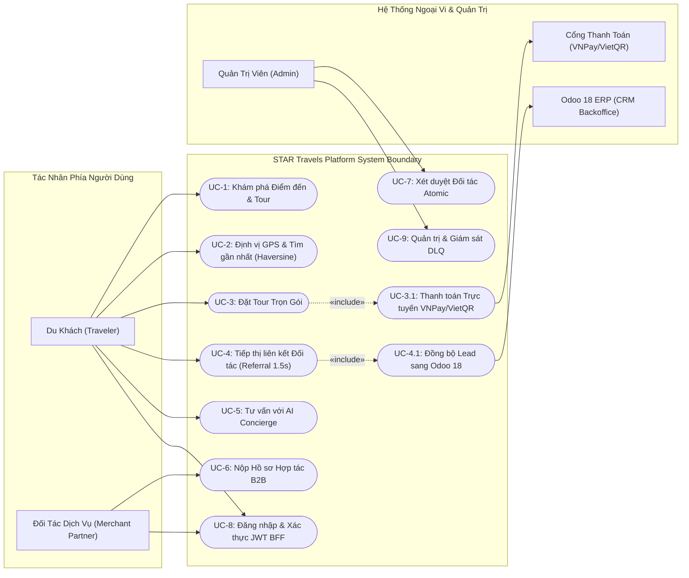
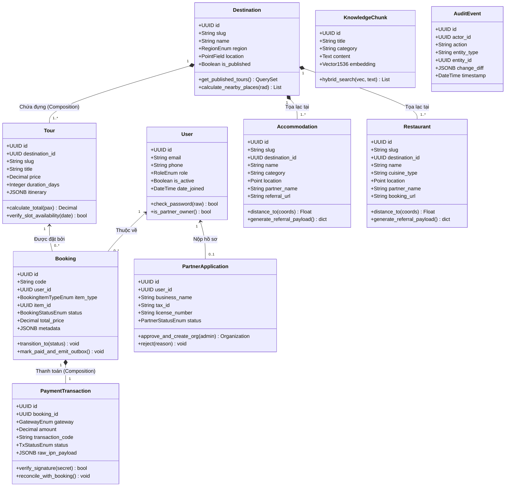
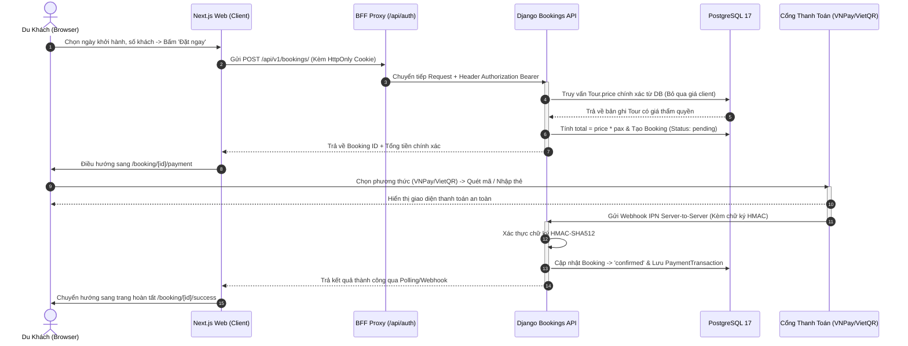
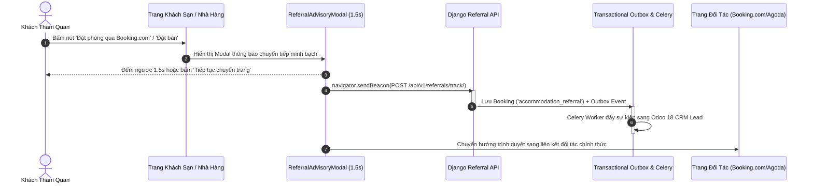
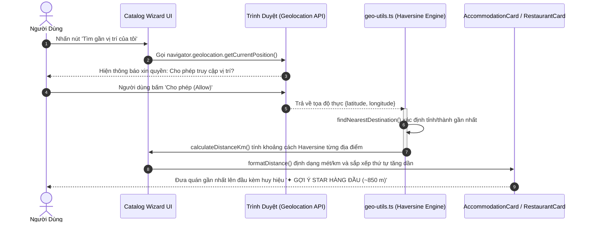
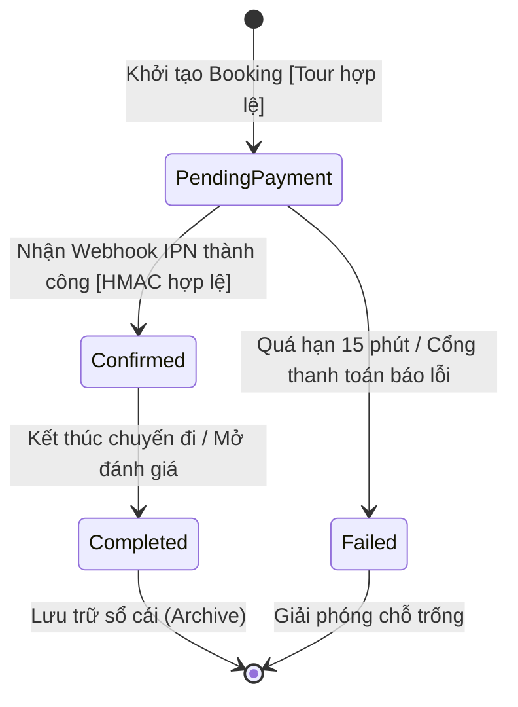
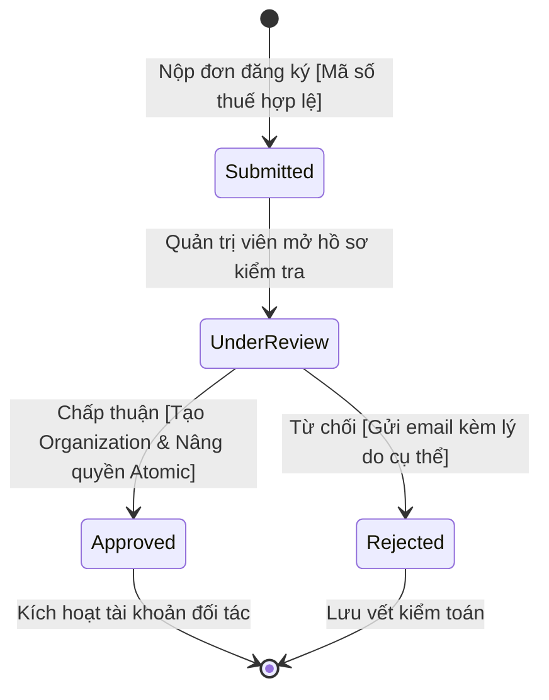
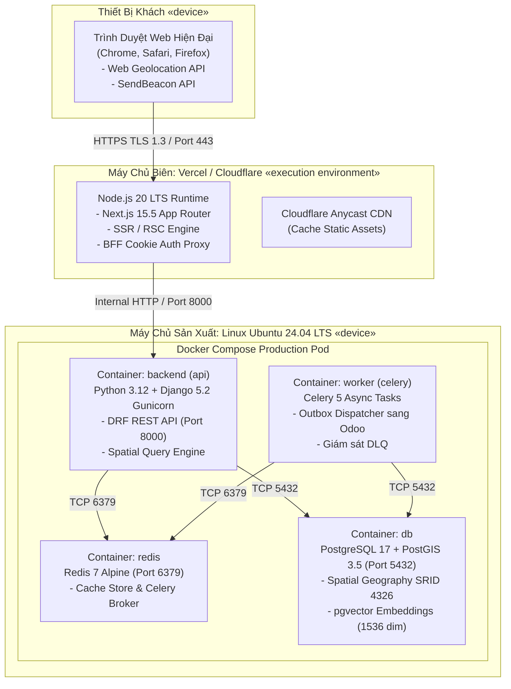

# STAR Travels — Bộ Biểu Đồ Thiết Kế UML Toàn Diện (UML 2.5)

Tài liệu này tổng hợp **toàn bộ 8 biểu đồ UML chuẩn hóa (OMG UML 2.5.1)** của nền tảng **STAR Travels**. 

> [!TIP]
> **Các cách xem và kéo thả diagram trực tiếp:**
> 1. **Kéo thả thật 100% trong Trình duyệt (Không cần cài gì):** 
>    - Click đúp vào file [`docs/diagrams/mo-so-do-keo-tha.bat`](file:///c:/Users/msi/Downloads/travel-platform-mvp-complete/travel-platform-mvp-complete/docs/diagrams/mo-so-do-keo-tha.bat) hoặc mở trực tiếp [`docs/diagrams/interactive-editor.html`](file:///c:/Users/msi/Downloads/travel-platform-mvp-complete/travel-platform-mvp-complete/docs/diagrams/interactive-editor.html).
>    - Trình duyệt sẽ mở ngay không gian làm việc Draw.io với đầy đủ 8 tab, thanh công cụ bên trái, cho phép **kéo thả khối, nối dây, đổi màu và xuất file** trực tiếp!
> 2. **Chỉnh sửa kéo thả ngay trong VS Code:**
>    - Cài extension **Draw.io Integration** (`hediet.vscode-drawio`). Dự án đã cấu hình sẵn trong `.vscode/settings.json`, sau khi cài extension bạn chỉ cần click vào bất kỳ file nào trong thư mục [`docs/diagrams/`](file:///c:/Users/msi/Downloads/travel-platform-mvp-complete/travel-platform-mvp-complete/docs/diagrams/) là VS Code sẽ mở bảng vẽ kéo thả ngay trong tab editor.
> 3. **Xem tĩnh trong Markdown:** Các hình vẽ Mermaid bên dưới giúp bạn xem nhanh tổng quan ngay trong file markdown (`Ctrl + Shift + V`).

---

## 1. Biểu Đồ Use Case Tổng Thể (UML Use Case Diagram)

Phân định ranh giới hệ thống **STAR Travels Platform**, 5 tác nhân (Actors) và 11 Use Case cốt lõi.



---

## 2. Biểu Đồ Lớp Miền Nghiệp Vụ (Domain Class Diagram)

Cấu trúc 10 thực thể dữ liệu chính thuộc 13 Bounded Contexts trong kiến trúc Monolith mô-đun:



---

## 3. Biểu Đồ Tuần Tự: Đặt Tour & Thanh Toán Trực Tuyến

Luồng đặt Tour trực tuyến với cơ chế bảo vệ giá độc quyền từ phía Server (Server-side price protection) và xác thực chữ ký số HMAC-SHA512:



---

## 4. Biểu Đồ Tuần Tự: Tiếp Thị Liên Kết Đối Tác (Affiliate Referral)

Mô hình tiếp thị liên kết (Booking.com, Agoda, TableCheck) sử dụng `navigator.sendBeacon()` không gây gián đoạn và đồng bộ CRM Lead sang Odoo 18:



---

## 5. Biểu Đồ Tuần Tự: Định Vị Vị Trí & Sắp Xếp Khoảng Cách (GPS Haversine)

Quy trình phát hiện vị trí địa lý tuân thủ **Nghị định 13/2023/NĐ-CP** (bảo vệ dữ liệu cá nhân), tính khoảng cách phía Client bằng công thức Haversine:



---

## 6. Biểu Đồ Thành Phần Kiến Trúc (Component Architecture)

Cấu trúc phân tầng Monolith mô-đun phân định rõ ràng giữa **Presentation**, **Contracts**, **13 Bounded Contexts**, và **Persistence**:

```mermaid
flowchart TD
    subgraph PRESENTATION [Tầng Trình Diễn: apps/public-site (Next.js 15)]
        AppRouter["App Router (25 Routes SSR & RSC)"]
        SearchCapsule["Dark Capsule Search & Hero"]
        GeoEngine["Geolocation & Haversine Engine"]
        ReferralEngine["Referral Advisory & Beacon"]
        AIChatWidget["AI Concierge Drawer Widget"]
        BFFProxy["BFF Auth Proxy (/api/auth/*)"]
    end

    subgraph CONTRACTS [Tầng Hợp Đồng: packages/contracts]
        TSTypes["TypeScript Interfaces (@travel/contracts)"]
        OpenAPISpec["OpenAPI 3.1 Specification"]
        Enums["Shared Enums (Booking, Roles, Status)"]
    end

    subgraph BACKEND_MONOLITH [Tầng Nghiệp Vụ Lõi: apps/api (Django 5.2 & DRF)]
        APIRoot["REST API Root (/api/v1/)"]
        AccountsCtx["Accounts Context (JWT Auth, RBAC)"]
        CatalogsCtx["Catalogs Context (Destinations, Tours)"]
        HospitalityCtx["Hospitality Context (Hotels, Dining)"]
        BookingsCtx["Bookings & Payments Context"]
        AIRagCtx["AI Concierge Context (pgvector)"]
        PartnersCtx["Partners Context (State Machine)"]
        OutboxCtx["Transactional Outbox & Celery Worker"]
        AuditCtx["Audit & Throttling Guard"]
    end

    subgraph PERSISTENCE [Tầng Dữ Liệu & Hạ Tầng]
        PG[(PostgreSQL 17 + PostGIS 3.5)]
        Redis[(Redis 7 Cache & Broker)]
        OdooERP[(Odoo 18 ERP)]
    end

    AppRouter --> TSTypes
    BFFProxy -->|HTTP JSON-RPC / REST| APIRoot
    APIRoot --> AccountsCtx
    APIRoot --> CatalogsCtx
    APIRoot --> HospitalityCtx
    APIRoot --> BookingsCtx
    APIRoot --> AIRagCtx
    APIRoot --> PartnersCtx

    CatalogsCtx --> PG
    BookingsCtx --> PG
    AIRagCtx --> PG
    OutboxCtx --> Redis
    OutboxCtx -->|Webhooks| OdooERP
```

---

## 7. Biểu Đồ Máy Trạng Thái (UML State Machine Diagram)

### 7.1. Vòng Đời Trạng Thái Booking (`bookings_booking`)


### 7.2. Vòng Đời Xét Duyệt Đối Tác Lữ Hành B2B (`partners_partnerapplication`)


---

## 8. Biểu Đồ Triển Khai Hạ Tầng (UML Deployment Diagram)

Kiến trúc phân bổ trên phần cứng vật lý, môi trường thực thi và các Container Docker:



---

## 9. Tóm Tắt Vị Trí Lưu Trữ Toàn Bộ Tài Liệu & Sơ Đồ
 
| Hạng Mục | Đường Dẫn File | Định Dạng & Cách Sử Dụng |
| :--- | :--- | :--- |
| **Trình soạn thảo kéo thả Draw.io 1-Click** | [`docs/diagrams/interactive-editor.html`](file:///c:/Users/msi/Downloads/travel-platform-mvp-complete/travel-platform-mvp-complete/docs/diagrams/interactive-editor.html) / [`mo-so-do-keo-tha.bat`](file:///c:/Users/msi/Downloads/travel-platform-mvp-complete/travel-platform-mvp-complete/docs/diagrams/mo-so-do-keo-tha.bat) | **Mở trực tiếp trên Chrome/Edge:** Nhúng giao diện Draw.io đầy đủ với 8 tab, thanh hình khối bên trái, kéo thả trực quan 100%, có nút tải file về máy. |
| **Thư mục 8 file Draw.io riêng lẻ** | [`docs/diagrams/`](file:///c:/Users/msi/Downloads/travel-platform-mvp-complete/travel-platform-mvp-complete/docs/diagrams/) | Chứa 8 file `.drawio` độc lập cho từng biểu đồ (`01-use-case-diagram.drawio`, `02-domain-class-diagram.drawio`, v.v.). |
| **Bản vẽ Draw.io tổng thể (8 Tab)** | [`docs/star-travels-uml.drawio`](file:///c:/Users/msi/Downloads/travel-platform-mvp-complete/travel-platform-mvp-complete/docs/star-travels-uml.drawio) | File XML đa trang; mở bằng [app.diagrams.net](https://app.diagrams.net/) hoặc extension VS Code `hediet.vscode-drawio` để kéo thả. |
| **Tài liệu xem trực tiếp Markdown** | [`docs/uml-diagrams.md`](file:///c:/Users/msi/Downloads/travel-platform-mvp-complete/travel-platform-mvp-complete/docs/uml-diagrams.md) | File Markdown tích hợp Mermaid đồ họa; mở bằng `Ctrl + Shift + V` trong VS Code. |
| **Script sinh sơ đồ tự động** | [`scripts/generate_drawio_uml.py`](file:///c:/Users/msi/Downloads/travel-platform-mvp-complete/travel-platform-mvp-complete/scripts/generate_drawio_uml.py) | Script Python sinh ra XML Draw.io đạt chuẩn OMG UML 2.5 và bộ công cụ kéo thả. |
| **Hướng dẫn kỹ năng vẽ** | [`.agents/skills/drawio-diagramming/SKILL.md`](file:///c:/Users/msi/Downloads/travel-platform-mvp-complete/travel-platform-mvp-complete/.agents/skills/drawio-diagramming/SKILL.md) | Cẩm nang chuẩn mực thiết kế sơ đồ, quy tắc đi dây, bảng màu và 10 điều răn kỹ sư đồ họa. |
